<!-- README.md is generated from README.Rmd. Please edit that file -->

<!-- README.md is generated from README.Rmd. Please edit that file -->

| 语言 / Language | 版本                               |
|-----------------|------------------------------------|
| 🇨🇳 中文         | [README.zh-CN.md](README.zh-CN.md) |
| 🇺🇸 English      | [README.md](README.md)             |

# chinacolor :Chinese Traditional Colors

<!-- badges: start -->

<!-- badges: end -->


## ✨ Latest Updates

### v0.1.0 (2025-10-05)

**New Features**

- Added 10 automatic palette generation functions such as
  `monochromatic_palette()`, `analogous_palette()`, etc.;

- The output of the `ctc_palette()` function now has a `palette type`
  attribute, just like the built-in palettes;

- The `scale_fill/color _ctc_c/d()` scale function series now support
  custom palettes with corresponding attributes, greatly enriching their
  applicability;

**Enhancements**

- Optimized some sequential and diverging built-in palettes, removed
  some palettes, added some new palettes; the count for each type
  remains unchanged.

- Optimized the `theme_ctc_*()` function series content, added theme
  options.

**Bug Fixes**

- Fixed errors in the summarized RGB values of the chinacolor base color
  data.

- Adjusted the font size of color values and Chinese names in the
  `plot_palette()` function.

### Future Update Plans

- Add palettes and theme functions from perspectives like application
  scenarios, industry attributes, etc., such as journal publication,
  daily office work, client orientation.

- Integrate machine learning with color theory, color psychology, color
  matching principles, etc., to obtain color psychological models for
  generating color schemes based on emotions and physical scenes.

------------------------------------------------------------------------

Below is introductory material including the update content.

Inspired by the Chinese book [“Traditional Chinese Colors: Color
Aesthetics in the Forbidden
City”](https://baike.baidu.com/item/%E4%B8%AD%E5%9B%BD%E4%BC%A0%E7%BB%9F%E8%89%B2%EF%BC%9A%E6%95%85%E5%AE%AB%E9%87%8C%E7%9A%84%E8%89%B2%E5%BD%A9%E7%BE%8E%E5%AD%A6/56817070),
this package was created. Key information for the 384 colors from the
book was compiled into color data. Based on this data:

- 20 sequential, 20 diverging, and 20 qualitative palettes are built-in;

- 5 ggplot-compatible plotting themes based on traditional Chinese
  cultural characteristics are built-in;

- Functions for browsing, printing these colors and palettes, and
  quickly obtaining color and palette information were formed;

- Tools for customizing palettes using these colors or built-in palettes
  were formed;

- **A series of functions for customizing palettes according to needs
  was formed, and the output can be applied to the scales series
  functions;**

- A scales series of functions compatible with ggplot plotting was
  formed.

<figure>

<figcaption aria-hidden="true">Color Graphic</figcaption>
</figure>

<figure>

<figcaption aria-hidden="true">All 384 Colors with Group ID</figcaption>
</figure>

<figure>

<figcaption aria-hidden="true">Colors Grouped by Solar Term</figcaption>
<figure>

<figure>

<figcaption aria-hidden="true">Palette Example</figcaption>
</figure>

<figure>

<figcaption aria-hidden="true">Palette Example</figcaption>
</figure>

## Installation

You can install the package by using the following methods.

``` r
 
devtools::install_github("zhiming-chen/chinacolor")

# or
remotes::install_github("zhiming-chen/chinacolor")
```

## Plot,Preview and Get the Colors

### plot_color_grid print colors

``` r
plot_color_grid(show_group = T)
```

All the colors for 24 solar terms can found in the folder
:[colors_by_solar_term](https://github.com/zhiming-chen/chinacolor/tree/master/image/color/colors_by_solar_term)

### list_colors Preview the colors in Viewer Panel

The `list_colors` function enables quick preview of colors in the Viewer
interface of RStudio and allows instant access to color hex values. This
feature is helpful when we design color palettes or adjust colors during
plotting.

``` r
list_colors()
```

<figure>

<figcaption aria-hidden="true">screen_shot for the preview
result</figcaption>
</figure>

## Palettes: Print, Preview, Obtain, and Customize

60 pre-defined palettes are included in this package for use. Several
palette examples:


The built-in palettes are defined as three types: Sequential, Diverging,
and Qualitative. 20 of each type.

The built-in color palettes are categorized into three types:
sequential, diverging, and qualitative, with 20 palettes for each type.

These color palettes are assigned IDs and named in a regularized way:

- sequential palettes：

  - id：1-20

  - name：seq01-seq20。

- diverging palettes：

  - id：21-40

  - name：div01-div20。

- qualitative palettes：

  - id：41-60

  - name：qual01-qual20。

these names are the element names for palette in the palette_list.

And，for each palette, an embedded list in the palette_list, has its
Chinese name and English,so we can get the palette information by put in
the id number(index),element name,Chinese name and English name for
palette.

### list_palettes Preview the palettes

The same method as `list_colors` function.

``` r

list_palettes()
```


We can also export information about these built-in palettes using this
function.

``` r
palettes_info <- list_palettes()

head(palettes_info,10)
#>       Index ElementName ChineseName     EnglishName       Type Colors
#> seq01     1       seq01    大地金秋    earth_autumn sequential      6
#> seq02     2       seq02    绯色年华  blooming_blush sequential      6
#> seq03     3       seq03    紫韵秘境 mystic_lavender sequential      6
#> seq04     4       seq04    珊瑚暖绯    coral_warmth sequential      7
#> seq05     5       seq05    幽兰绀紫   mystic_purple sequential      7
#> seq06     6       seq06    金秋丰韵  golden_harvest sequential      9
#> seq07     7       seq07    橘暖时光       warm_glow sequential      7
#> seq08     8       seq08    琥珀大地     amber_earth sequential      7
#> seq09     9       seq09    林间雾色     forest_mist sequential      6
#> seq10    10       seq10    琥珀流光      amber_glow sequential      7
```

### plot_palettes: Plot Multipule Palettes

The `plot_palettes` function supports printing multiple palettes on a
single plot, facilitating palette comparison and selection. Supports
input by index and element names.

``` r
#  input the number vector for palettes id or index 
plot_palettes(1:5)
```


``` r

# input the element name for palettes
plot_palettes(c("seq01","div02","qual14","qual18"))
```

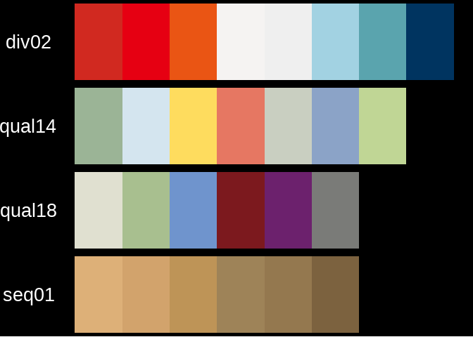

### plot_palette: Plot a Single Palette

This function prints built-in palettes and also supports printing custom
palettes. Default mode is for built-in palettes.

When printing built-in palettes, it supports input by index, element
names, and the palette’s Chinese/English names.

We can set the parameters to match you requirement to the plot.

- plot built_in palettes

``` r
# input index number in an easy way, show_text default value is FALSE.
plot_palette(x = 43,show_text = T)
```


``` r
# input the element name,and can also named the palette title/name by your owner words

plot_palette(x = "div13",name = "ONLY FOR PROJECT A!!!")
```


``` r
# Print by palette English name, display color information

plot_palette(x = "forest_mist",show_text = T)
```


``` r

# Print by palette Chinese name, display color information
plot_palette(x = "碧海晴空",show_text = T)
```


For built-in palettes, the central bar in the printed graphic displays
four pieces of information about the palette to aid quick memory and
selection. The bottom can display the color hex values and their Chinese
names. For display effect considerations, this parameter is set to
non-default display.

- plot custom palettes

For custom palettes, the input can be a color vector or the name of a
vector object.

For colors from the 384 built-in colors, displaying the Chinese name is
supported.

``` r
#  color vector input and named palette tile 
plot_palette(x = c("#99BCAC","#5F4321","#BA5140","#DD7694","#779649"),type = "custom",name = "Just for Test",show_text = T)
```


``` r

# no tilte and no color information plot
plot_palette(x = c("#99BCAC","#5F4321","#BA5140","#DD7694","#779649"),type = "custom")
```


``` r
# object name as input,and the name given to the plot title

test_pal <- c("#C67915","#2C2F3B","#9A6655","#A72126","#446A37","#5B3222")
plot_palette(x = test_pal,type = "custom",show_text = T)
```


### ctc_palette Modify and Customize Palttes

Function `ctc_palette` designed to get and modify the built_in
palettes,and pick the color from 384 colors collection to create new
palettes.

The output of the function can be the color value input for many other
plot function,also worked for `scale_fill(color)_ctc_c/d/m` function in
this package.

The `type` parameter defaults to `built_in`, i.e., built-in palettes.

#### Get and modify the built_in palettes

The same as `plot_palette` function, parameter `palette_name` accept the
index number,element name,Chinese and English name for the palettes.

parametr `n` defined the number of color in your new palette,for
qualitative palettes,It is strongly recommend the number DO NOT more
than the number of the colors in the built_in palette.

``` r
# input index number, with the color number and direction,and show_colors
pal_1 <- ctc_palette(palette_name = 2,n = 5,direction = 1,show_colors = T)
#> Colors in the palette:
#> [1] "#F9D3E3" "#ECB0C1" "#DE82A7" "#CC73A0" "#B95A89"
#> Number of colors: 5
```


``` r
# input the element name and the color number more than the one in the target palette
pal_2 <- ctc_palette(palette_name = "seq02",n = 12,show_colors = T) 
#> Colors in the palette:
#>  [1] "#F9D3E3" "#F3C3D3" "#EDB3C4" "#E69FB7" "#E08AAB" "#D97DA5"
#>  [7] "#D077A1" "#C86E9B" "#BF6391" "#B75685" "#AF4675" "#A73766"
#> Number of colors: 12
```


``` r
## example for diverging palettes 

pal_3 <- ctc_palette(type = "built_in",palette_name = 22, n = 5, direction = 1,  show_colors = T)
#> Colors in the palette:
#> [1] "#E60012" "#EA5514" "#F5F3F2" "#EFEFEF" "#A2D2E2"
#> Number of colors: 5
```


``` r
pal_4 <- ctc_palette(type = "built_in",palette_name = 22, n = 12, direction = - 1)
```

``` r
#  example for qualitative palettes
# Can see what happened when n value more than the numbers of colors in the palette.
pal_5 <- ctc_palette(type = "built_in",palette_name = 44, n = 12,direction = 1,show_colors = T)
#> Colors in the palette:
#>  [1] "#C8161D" "#003460" "#B6A014" "#779649" "#A6559D" "#FEDC5E"
#>  [7] "#94784F" "#6E9BC5" "#C8161D" "#003460" "#B6A014" "#779649"
#> Number of colors: 12
```


``` r

pal_6 <- ctc_palette(type = "built_in",palette_name = 44, n = 5,direction = 1,show_colors = T)
#> Colors in the palette:
#> [1] "#C8161D" "#003460" "#B6A014" "#779649" "#A6559D"
#> Number of colors: 5
```


``` r
pal_7 <- ctc_palette(type = "built_in",palette_name = 44, direction = 1,show_colors = T)
#> Colors in the palette:
#> [1] "#C8161D" "#003460" "#B6A014" "#779649" "#A6559D" "#FEDC5E" "#94784F"
#> [8] "#6E9BC5"
#> Number of colors: 8
```

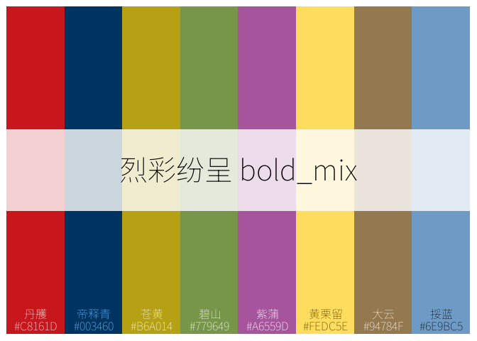

#### Pick up colors from 384 colors to creat palettes

In this mode, the `palette_name` (palette name), `n`(number of colors),
and `direction` (color direction) parameters are ineffective.

Use the `color_pick` parameter to select color groups and subgroup
indices and/or color IDs. Order requirements can also be input here.

More conveniently, use the `create_color_pick` helper function to easily
generate the color-picking list.

- generate a diverging palette with 9 colors

``` r
 
color_pick_1 <- create_color_pick(groups = c(11,13,12),
                                  subgroups = list(4:1,1,1:4),
                                  order_rule =1)
 
Palette_C <- ctc_palette(type = "custom",
            color_pick =color_pick_1,
            show_colors = T,
            palette_title = "gold_blue")
#> Colors in the palette:
#> [1] "#C67915" "#DB9B34" "#FAC03D" "#FEDC5E" "#EBEEE8" "#9AA7B1" "#6B798E"
#> [8] "#45465E" "#2C2F3B"
#> Number of colors: 9
```


``` r
Palette_C
#> [1] "#C67915" "#DB9B34" "#FAC03D" "#FEDC5E" "#EBEEE8" "#9AA7B1" "#6B798E"
#> [8] "#45465E" "#2C2F3B"
#> attr(,"type")
#> [1] "qualitative"
#> attr(,"n")
#> [1] 9
#> attr(,"ctc_colors")
#> [1] TRUE
```

- generate qualitative palettes with 6 colors

``` r
color_pick_2 <- create_color_pick(groups = 10:15,
                                  subgroups = 3,
                                  order_rule =1)
color_pick_3 <- create_color_pick(groups = 10:15,
                                  subgroups = 4,
                                  order_rule =-1)

Palette_A <-  ctc_palette(type = "custom",
            color_pick =color_pick_2,
            show_colors = T,
            palette_title = "Palette A")
#> Colors in the palette:
#> [1] "#DC6B82" "#DB9B34" "#45465E" "#E0E0D0" "#B26D5D" "#C8161D"
#> Number of colors: 6
```


``` r
Palette_B <- ctc_palette(type = "custom",
            color_pick =color_pick_3,
            show_colors = T,
            palette_title = "Palette B")
#> Colors in the palette:
#> [1] "#A72126" "#9A6655" "#C7C6B6" "#2C2F3B" "#C67915" "#C35C5D"
#> Number of colors: 6
```


``` r
Palette_A 
#> [1] "#DC6B82" "#DB9B34" "#45465E" "#E0E0D0" "#B26D5D" "#C8161D"
#> attr(,"type")
#> [1] "qualitative"
#> attr(,"n")
#> [1] 6
#> attr(,"ctc_colors")
#> [1] TRUE
Palette_B
#> [1] "#A72126" "#9A6655" "#C7C6B6" "#2C2F3B" "#C67915" "#C35C5D"
#> attr(,"type")
#> [1] "qualitative"
#> attr(,"n")
#> [1] 6
#> attr(,"ctc_colors")
#> [1] TRUE
```

#### Custom Palettes with Type Attribute (New Feature)

Each palette generated by the ctc_palette() function has a palette type
attribute;

When the function parameter is built_in, the output palette type equals
the type of the built-in palette; as for the palettes generated earlier,
their types are as follows:

``` r
attr(pal_1,"type")
#> [1] "sequential"
attr(pal_3,"type")
#> [1] "diverging"
attr(pal_5,"type")
#> [1] "qualitative"
```

When the function parameter is custom, the output palette type can be
customized, defaulting to `qualitative`. We can define it based on our
understanding of the custom palette’s type.

Palette type only supports `sequential`, `diverging`, `qualitative`;
defining other types will default to `qualitative`.

The custom palettes Palette_A/B/C from earlier did not define the
palette type, defaulting to qualitative

``` r
attr(Palette_A,"type")
#> [1] "qualitative"
attr(Palette_B,"type")
#> [1] "qualitative"
attr(Palette_C,"type")
#> [1] "qualitative"
```

But for Palette_C, we consider it a diverging palette, palette type is
diverging. According to the updated function capabilities, we can
customize its type:

``` r
color_pick_1 <- create_color_pick(groups = c(11,13,12),
                                  subgroups = list(4:1,1,1:4),
                                  order_rule =1)
 
Palette_D <- ctc_palette(type = "custom",
            color_pick =color_pick_1,
            show_colors = T,
            palette_title = "金波碧浪",palette_type = "diverging")
#> Colors in the palette:
#> [1] "#C67915" "#DB9B34" "#FAC03D" "#FEDC5E" "#EBEEE8" "#9AA7B1" "#6B798E"
#> [8] "#45465E" "#2C2F3B"
#> Number of colors: 9
```

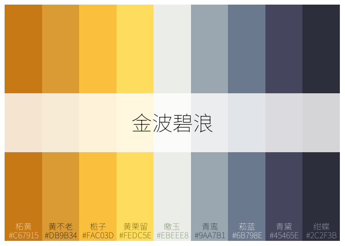

``` r
attr(Palette_D,"type")
#> [1] "diverging"
```

Because its type is different, its usage when combined with the `scale*`
series functions introduced later will also differ.

Based on these attribute confirmations, they can be flexibly applied
directly in the updated `sacle_fill/color_ctc_c/d()` and other
functions.

## Automatic Palette Generation Functions(**New Feature**)

A series of features introduced in this update.

In the R world, there are many packages for plotting color palettes,
offering a vast number of palettes for use, such as the 60 built-in
palettes in this package, which are certainly just the tip of the
iceberg.

Often, we want to customize palettes. The `ctc_palette()` function in
this package partially implements this functionality but is somewhat
cumbersome.

Inspired by `adobe CC`, automatic palette generation functions based on
general color matching principles and ideas were created. There are 10
functions in total, capable of generating monochromatic sequential
palettes, multi-color gradient/analogous palettes, diverging palettes,
triadic, square, contrasting, complementary, discretely uniformly
distributed, and other common discrete color schemes.

Here are a few examples of palettes generated by these functions,
compared with results generated by [adobe
CC](https://color.adobe.com/zh/create/color-wheel).

### Generate Palettes

- `monochromatic_palette()` function generates a continuous gradient
  palette of the same HUE series.

You can specify the base color (can also be left empty, then a random
color from the 384 built-in colors will be selected), the number of
colors, the lightness range, and whether to use the 384 built-in Chinese
Traditional Colors.

*Due to the limited number of built-in colors, for palettes with
continuous gradient properties, selecting built-in colors may lead to
some unexpected results.*

``` r
pal_mono <- monochromatic_palette(base_color = "#DB9C53",n = 6,ctc_colors = F,show_pal = T)
```

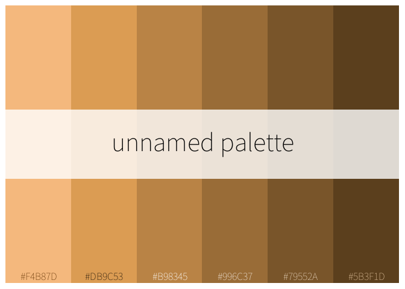

``` r
pal_mono_ctc <- monochromatic_palette(base_color = "#DB9C53",n = 6,ctc_colors = T,show_pal = T)
```


- `analogous_palette()` function generates analogous colors

This function generates a palette within approximately 30 degrees on
either side of the base color’s hue value (range can be customized),
with overall lightness remaining largely constant.

When the number of colors is large and the hue progression step is
small, this function achieves a color wheel effect with continuous hue
gradation within a certain range.

``` r
pal_analog <- analogous_palette(base_color = "#DB9C53",n = 6,ctc_colors = F,show_pal = T,spread = 15)
```


``` r
pal_analog_ctc <- analogous_palette(base_color = "#DB9C53",n = 6,ctc_colors = T,show_pal = T,spread = 15)
```


Achieve the `color wheel effect` of continuous hue gradation within a
certain range for different hue values.

``` r
pal_analog_hue <- analogous_palette(base_color = "#FF0C00",n = 9,ctc_colors = F,show_pal = T,spread = 5)
#> Warning in analogous_palette(base_color = "#FF0C00", n = 9, ctc_colors =
#> F, : It is highly recommended that the number of colors is no less than
#> 3 and no more than 7.
```


- `triadic_palette()` function generates a triadic color palette.

Starting from the base color hue, increment by 120 degrees to obtain
three colors on the hue color wheel, then determine the colors based on
the input number of colors to form a triadic palette.

``` r
pal_tri <- triadic_palette(base_color = "#DB9C53",n = 6,ctc_colors = F)
```


``` r

pal_tri_ctc <- triadic_palette(base_color = "#DB9C53",n = 6,ctc_colors = T)
```

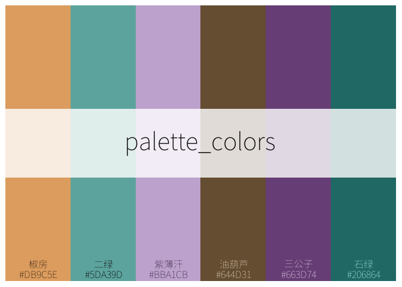

- `intermediate_palette` function generates a square palette.

Based on the base color hue, increment by 90 degrees to obtain a total
of four colors, then use these four colors and the number of colors to
obtain the palette. When the number of colors is 4, the result is the
same as the harmonic_palette() function.

Palettes obtained by this function often have strong contrast.

``` r
pal_square <- intermediate_palette(base_color = "#DB9C53",n = 6,ctc_colors = F)
```


``` r
pal_square_ctc <- intermediate_palette(base_color = "#DB9C53",n = 6,ctc_colors = T)
```


- `complementary_palette` function generates a complementary color
  palette.

Determine the complementary color based on the base color, then obtain
the complementary color palette based on the number of colors.

``` r
pal_comp <- complementary_palette(base_color = "#DB9C53",n = 6,ctc_colors = F)
```


``` r
pal_comp_ctc <- complementary_palette(base_color = "#DB9C53",n = 6,ctc_colors = T)
```


- `split_complementary_palette` function generates a split-complementary
  color palette.

Similar to the triadic palette, obtain colors at 150 degrees on either
side of the base color hue value, then generate the palette based on the
number of colors.

``` r
pal_split <- split_complementary_palette(base_color = "#DB9C53",n = 6,ctc_colors = F)
```


``` r
pal_split_ctc <- split_complementary_palette(base_color = "#DB9C53",n = 6,ctc_colors = T)
```


- `concyclic_palette`function generates a mixed-effect palette.

Implements the base color and its hue shifted by 45 degrees, then
determines the palette based on these two colors, their symmetric colors
on the same side, and the number of colors.

``` r
pal_conc <-  concyclic_palette(base_color = "#DB9C53",n = 6,ctc_colors = F)
```


``` r
pal_conc_ctc <-  concyclic_palette(base_color = "#DB9C53",n = 6,ctc_colors = T)
```

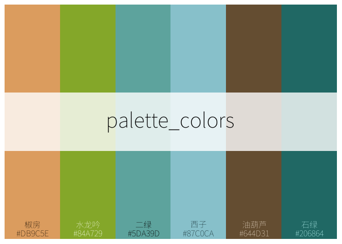

- `antipodal_palette`function generates a mixed-effect palette.

Similar to the concyclic_palette function, this function achieves
bilateral symmetric distribution of colors. Among the four points
distributed on the color wheel, three are the same as the
concyclic_palette function. Visually, palettes generated by this
function have stronger contrast and greater visual impact.

``` r
pal_anti <- antipodal_palette(base_color = "#DB9C53",n = 6,ctc_colors = F)
```


``` r
pal_anti_ctc <- antipodal_palette(base_color = "#DB9C53",n = 6,ctc_colors = T)
```

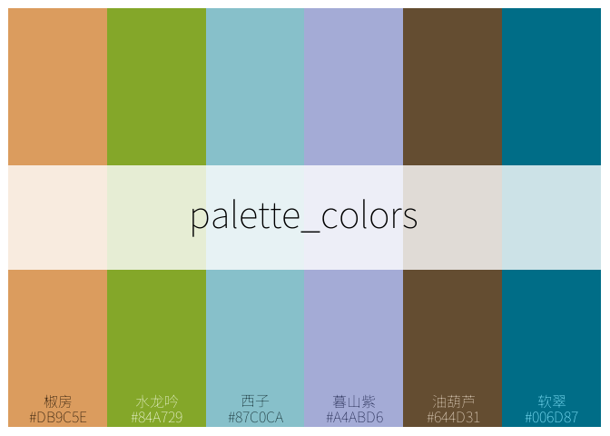

- `harmonic_palette` function generates a uniformly distributed discrete
  palette.

Takes uniform values on the 360-degree hue color wheel, starting from
the base color hue value; typical for discrete color scenarios.

Compared to other discrete palette generation functions, this function
supports scenarios with a relatively large number of colors, but it is
still not recommended to exceed 12.

``` r
pal_harmonic <- harmonic_palette(base_color = "#DB9C53",n = 6,ctc_colors = F)
```


``` r
pal_harmonic_ctc <- harmonic_palette(base_color = "#DB9C53",n = 8,ctc_colors = T)
```


- `diverging_palette`function generates a diverging palette.

Based on the base color hue, according to the designed angle for the
other end of the divergence (default 120 degrees) and the number of
colors, generates a diverging palette.

The lightness range can also be set to define the overall lightness of
the palette.

When the number of colors is large, for the sake of overall diverging
gradient effect, you may choose not to use the built-in 384 colors.

``` r
# Wider lightness range
pal_div_ctc <- diverging_palette(base_color = "#DB9C53",n = 9,ctc_colors = T,lightness_range = c(15,95))
```


``` r

# Narrower lightness range, brighter design, adjust angle to 90 degrees to reduce visual contrast impact.
pal_div <- diverging_palette(base_color = "#DB9C53",n = 9,ctc_colors = F,lightness_range = c(40,95),angle = 90)
```


### Summary Preview of Automatically Generated Palettes

Summary preview of various palettes generated with base color
“\#DB9C53”, all selecting to use the built-in 384 colors.

``` r
swatchplot("Monochromatic" = pal_mono_ctc,
           "Analogous" = pal_analog,
           "Diverging" = pal_div_ctc,
           "Triadic" = pal_tri,
           "Square" = pal_square_ctc,
           "Complementary" = pal_comp_ctc,
           "Split Complementary" = pal_split_ctc,
           "Mixed_1" = pal_conc_ctc,
           "Mixed_2" = pal_anti_ctc,
           "Uniform Discrete" = pal_harmonic_ctc,
           line = 8
           )
```


### A Few Simple Effect Comparisons with Adobe CC

The aforementioned functions are currently at a very basic stage, with
very few parameters involved in palette design output, merely outputting
based on some basic color matching principles. However, because they
follow some basic color matching principles, the output effects are
certainly presentable and can be used in practical scenarios like data
visualization.

Here, using “\#DB9C53” as the base color and a palette color count of 6,
let’s compare the effects with Adobe CC.

``` r
# Helper function for processing color order

ordered_color_set <- function(color_set,direction = 1){#1 large to small, 2 small to large

    color_set_order <-  color_set %>%
        .get_hcl_values() %>%
        .[,1] %>%
        order()

    color_set <- if (direction == 1){
        color_set[color_set_order]} else{
            color_set[rev(color_set_order)]
        }

    return(color_set)
}


ordered_color_set_hue <- function(color_set,direction = 1){ #1 大到小，2 小到大

    color_set_order <-  color_set %>%
        .get_hcl_values() %>%
        .[,3] %>%
        order()

    color_set <- if (direction == 1){
        color_set[color_set_order]} else{
            color_set[rev(color_set_order)]
        }

    return(color_set)
}
```

- Continuous Gradient Colors

- Results from Adobe CC

``` r
color_cc_mono <- c("#b18b61","#867460","#db9c53","#5c5751","#332d26","#33291e") %>%
    ordered_color_set(direction = 1)

color_cc_shade <- c("#D39650","#B17E43","#db9c53","#8F6536","#6D4D29","#4B351C") %>%
    ordered_color_set(direction = 1)
```

``` r
swatchplot("mono_F" = pal_mono,
           "mono_T" = pal_mono_ctc,
           "CC_shade" = color_cc_shade,
           "CC_mono" = color_cc_mono)
```


- Triadic Palette

``` r
# Color results from Adobe CC
 color_cc_tri <- c("#8453db","#53db6d","#db9c53","#867460","#55515c","#515c53")


# To achieve consistent sorting effect, process the sorting of CC's color combination.

test_tri <- find_closest_colors(target_colors = pal_tri,ref_colors = color_cc_tri)
color_cc_tri <- test_tri$closest_ref

swatchplot("tri_F" = pal_tri,
           "tri_T" = pal_tri_ctc,
           "CC_tri" = color_cc_tri)
```


- `Square` Palette

``` r
# Color results from Adobe CC
color_cc_square <- c("#CF53db","#53B3db","#db9c53","#93db53","#867460","#5b515c")

# To achieve consistent sorting effect, process the sorting of CC's color combination.
test_square <- find_closest_colors(target_colors = pal_square, ref_colors = color_cc_square)
color_cc_square <- test_square$closest_ref

swatchplot("square_F" = pal_square,
           "square_T" = pal_square_ctc,
           "CC_square" = color_cc_square)
```


## Use the palette in ggplot

The output of the `ctc_palette` function is a set of color hex values.
These outputs can be directly used as color values in ggplot plotting.

The output of palette generation functions like `monochromatic_palette`
can also be used in ggplot plotting.

- Discrete Color + Fill

``` r

# ctc_palette function output: directly calling built-in palette
ggplot(data = iris,aes(x = Species,y = Petal.Length,fill = Species))+
    geom_violin()+
    scale_fill_manual(values = ctc_palette(palette_name = 48,n = 3))
```


``` r

# ctc_palette function output, using a palette customized by this function
ggplot(data = iris,aes(x = Species,y = Petal.Length,fill = Species))+
    geom_violin()+
    scale_fill_manual(values = Palette_A)
```

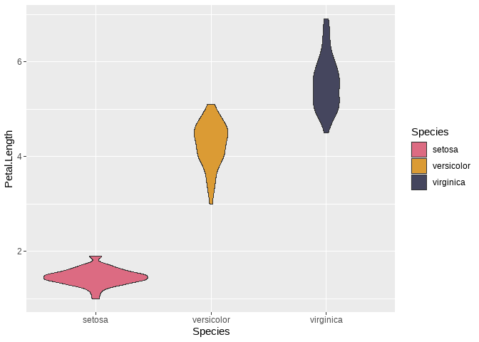

``` r

# Using an automatically generated palette, this example uses the palette generated by the triadic_palette() function
ggplot(data = iris,aes(x = Species,y = Petal.Length,fill = Species))+
    geom_violin()+
    scale_fill_manual(values = pal_tri_ctc)
```


- Discrete + Color

Select built-in qualitative palette.

``` r
ggplot(data = iris,aes(x = Sepal.Length  ,y = Sepal.Width  ,color = Species))+
    geom_point(size = 4)+
    scale_color_manual(values = ctc_palette(palette_name = 44,n = 3))
```


``` r

ggplot(data = iris,aes(x = Sepal.Length  ,y = Sepal.Width  ,color = Species))+
    geom_point(size = 4)+
    scale_color_manual(values = pal_harmonic_ctc)
```


- Continuous Color + Color

Select sequential built-in palette.

``` r
ggplot(data = iris,aes(x = Species,y = Sepal.Width,color = Sepal.Width))+
    geom_point(size = 4)+
    scale_color_gradientn(colours = ctc_palette(palette_name = 9))
```


``` r


# Using a function-generated sequential palette

pal_seq <- monochromatic_palette(base_color = "#D23918",n = 9,ctc_colors = T,show_pal = F,lightness_range = c(10,95))

ggplot(data = iris,aes(x = Species,y = Sepal.Width,color = Sepal.Width))+
    geom_point(size = 4)+
    scale_color_gradientn(colours = rev(pal_seq))
```

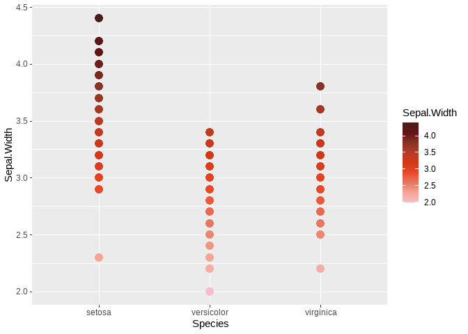

- Continuous + Fill

This example uses the custom diverging palette vector from earlier.

``` r
 
df <- expand.grid(x = 1:20, y = 1:20)
df$z <- (df$x - 10) * (df$y - 10)   

ggplot(df, aes(x, y, fill = z)) +
  geom_tile(color = "white", linewidth = 0.3) +   
  scale_fill_gradientn(
    colours = rev(Palette_C),  # Reverse it, cool colors represent negative values, warm colors represent positive values.
    name = "Values",
  ) +
  labs(title = "Palette Test") +
  theme_minimal()
```


 
##  Adapted for ggplot Plotting: scales Series Functions and theme Templates
 
 

### Update Notes

1.  Important adjustments have been made to the palette input for the
    `scale` series functions: For the `*_d` and `*_c` series functions,
    the previous version supported built-in palettes; after the update,
    they support any palette with the required specified attributes.

- `*_d` series supports `qualitative` type palettes.
- `*_c` series supports `sequential` and `diverging` type palettes.

The `ctc_palette` function has been updated; its output palettes now
have a type attribute. The output of this function in `custom` mode can
also be used in the `*_d` and `*_c` series functions. This is an update
from the previous version. Subsequently, the `*_m` series in the scale
functions will be gradually phased out.

The output of the 10 automatic palette generation functions like
`monochromatic_palette` can also be directly used in the `scale` series
functions;

Furthermore, any custom color vector can be manually assigned a palette
type attribute and can also be used in this series of functions.

2.  The `theme` functions have been updated, adding some schemes.
    Significant changes have been made to the `ink` series functions.
    The display effect in the previous version was poor; this update
    greatly improves the display effect.

### Six groups of scales series functions:

- scale_fill_ctc_d : Discrete color + fill scenarios

- scale_color_ctc_d： Discrete color + color scenarios

- scale_fill_ctc_c： Continuous color + fill scenarios

- scale_color_ctc_c： Continuous color + color scenarios

- scale_fill_ctc_m： Custom color + fill scenarios, only supports
  discrete color scenarios

- scale_color_ctc_m： Discrete color + color scenarios, only supports
  discrete color scenarios

The first four functions support using built-in palettes as input. Like
`ctc_palette()`, they support four types of input palette information to
obtain built-in palettes;

The latter two support using custom palettes as input; they are
equivalent to the `scale_fill(color)_manual()` functions in the ggplot2
package; they also support the `color_pick` list, which can be generated
by the `create_color_pick()` function or manually generated. This
belongs to the exclusive custom color input channel for the 384 colors.

### Five groups of ggplot plotting themes, created based on traditional Chinese cultural elements, available for selection.

- theme_ctc_paper: Rice paper theme

- theme_ctc_dunhuang: Dunhuang theme

- theme_ctc_bronze: Bronze ware theme

- theme_ctc_mineral: Earth theme

- theme_ctc_ink: Ink wash painting theme

### Combination Cases: Palette Generation & Call + scale Series Functions + theme Series Functions

#### theme_ctc_ink() + ctc_palette()+ `scale_*`

Custom `diverging` palette, directly used in `scale` series functions.

``` r
 # Diverging palette generated by ctc_palette function + scale_*_c series functions

df <- expand.grid(x = 1:20, y = 1:20)
df$z <- (df$x - 10) * (df$y - 10) 

ggplot(df, aes(x, y, fill = z)) +
  geom_tile(color = "white", linewidth = 0.3) +   
  scale_fill_ctc_c(palette_name = Palette_D ,direction = -1) + # Using the diverging palette generated earlier by the ctc_palette function 
  labs(title = "Palette Test",
       subtitle =  "Case 1: Using Palette with Attributes in Scale Series Functions") +
  theme_ctc_ink(background_type = "dark")
```

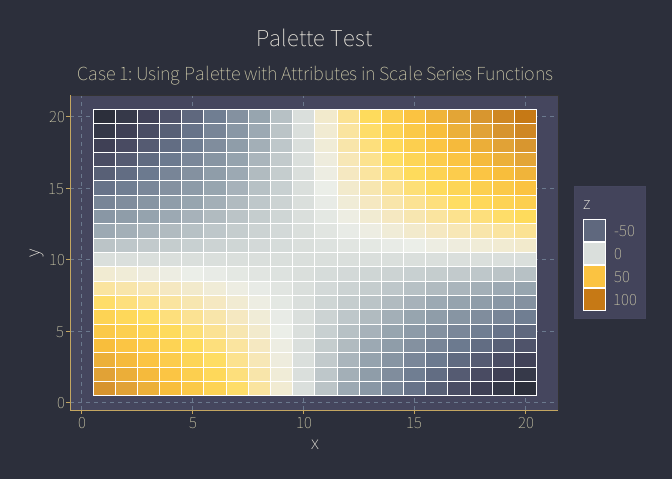

#### theme_ctc_dunhuang() + monochromatic_palette() + `scale_*`

``` r
data("mtcars")
dfm <- mtcars

# Add the name colums
dfm$name <- rownames(dfm)

p1 <- ggpubr::ggdotchart(dfm, x = "name", y = "mpg",
           color = "mpg",                            
           sorting = "ascending",  
           add = "segments" 
           )

pal_mono_2 <- monochromatic_palette(base_color = "#007175",n = 7,lightness_range = c(10,95),show_pal = F)
p2 <- p1 +
  scale_color_ctc_c(palette_name = pal_mono_2,direction = -1)+ 
    theme_ctc_dunhuang(bg_type = "classic",
                       text_angle_control = F,
                       grid_major = F,
                       grid_minor = F) +
    labs(title = "Palette Test",
       subtitle = "Case 2: Using Palette with Attributes in Scale Series Functions") 
p1
```


``` r
p2
```

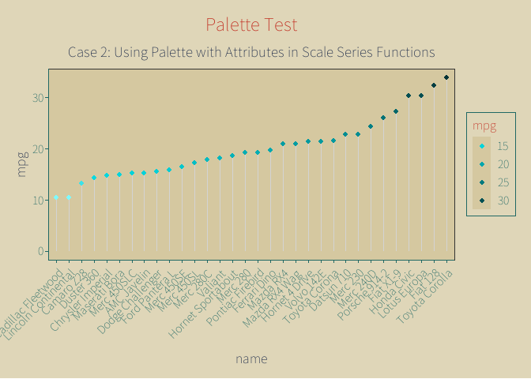

``` r

#Using discrete colors

# Convert the cyl variable to a factor
dfm$cyl <- as.factor(dfm$cyl)

p3 <- ggpubr::ggdotchart(dfm, x = "name", y = "mpg",
           color = "cyl",  
            sorting = "ascending",    
           add = "segments"   
           )
pal_anti_2 <- antipodal_palette(base_color = "#D23918",n = 8,show_pal = F)
p4 <- p3 +
    scale_color_ctc_d(palette_name = pal_anti_2)+
    theme_ctc_dunhuang(bg_type = "classic",
                       text_angle_control = F,
                       grid_major = F,
                       grid_minor = F)

p3 
```


``` r
p4
```


``` r
 # scale_fill_ctc_m function
 ggplot(iris, aes(Sepal.Length, Sepal.Width, fill = Species)) +
 geom_point(shape = 21, size = 3) +
 scale_fill_ctc_m(color_pick = color_pick_2) + ## This example uses the pick_color list completed earlier in the text.
theme_ctc_dunhuang(bg_type = "modern")
```

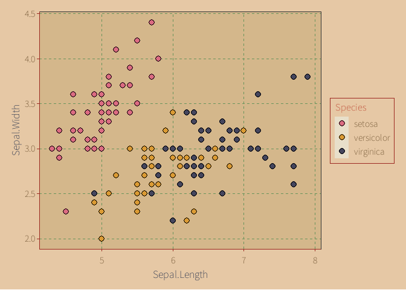

#### theme_ctc_mineral() + intermediate_palette() functions etc. + `scale_*`

``` r
 iris$sepal_group <- cut(
     iris$Sepal.Length,
    breaks = 4,
   labels = paste0("组", 1:4)
 )
# Using palette index value + mineral  theme
 ggplot(iris, aes(x = Sepal.Width,
                       y = Petal.Width,
                       color = sepal_group)) +
    geom_point(size = 2.5) +   
   geom_smooth(method = "lm", formula = y ~x, se = FALSE) +   
     scale_color_ctc_d(palette_name = 60)+   
    theme_ctc_mineral(background_type = "classic") 
```


``` r

# Using function-generated palette + mineral theme

pal_square_2 <- intermediate_palette(base_color = "#06436F",n = 7,show_pal = F)
 ggplot(mpg, aes(x = class, fill = class)) +
 geom_bar() +
 scale_fill_ctc_d(palette_name = pal_square_2)+
 theme_ctc_mineral(background_type = "light")
```

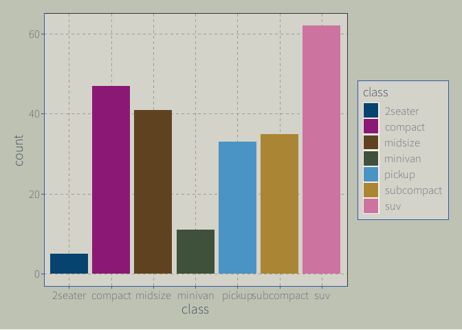

#### theme_ctc_paper() + analogous_palette() functions etc. + `scale_*`

``` r

# Using palette English name
 ggplot(mtcars, aes(x = wt, y = mpg, color = hp)) +
 geom_point(size = 4) +
 scale_colour_ctc_c(palette_name = "vibrant_spring", direction = -1)+
    theme_ctc_paper(paper_type = "aged")
```

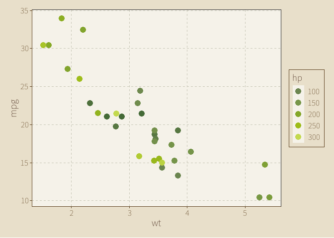

``` r
# Using function-generated palette
ggpubr::ggbarplot(dfm, x = "name", y = "mpg",
          fill = "mpg",    
          color = "white",   
 
          sort.val = "desc",         
          sort.by.groups = FALSE,   
          ) +
  scale_fill_ctc_c(palette_name = pal_analog_hue, direction = -1)+
  theme_ctc_paper()+
  theme(axis.text.x = element_text(angle = 90))
```


#### theme_ctc_bronze() + diverging_palette() functions etc. + `scale_*`

``` r
 #Using palette Chinese name + Bronze theme
ggplot(faithfuld, aes(x = eruptions, y = waiting, fill = density)) +
 geom_raster() +
 scale_fill_ctc_c(palette_name = "海天沙影", direction = 1)+
    theme_ctc_bronze()
```

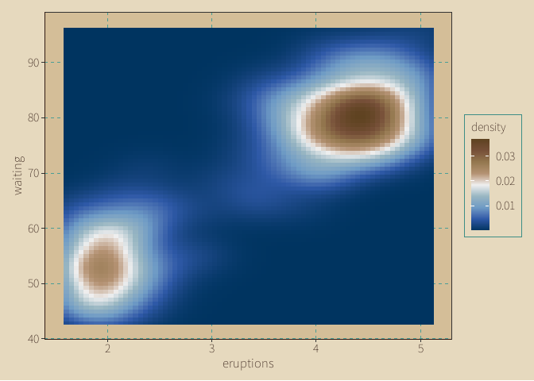

``` r
  # Using diverging_palette function generated palette + Bronze theme

ggplot(faithfuld, aes(x = eruptions, y = waiting, fill = density)) +
 geom_raster() +
 scale_fill_ctc_c(palette_name = pal_div_ctc, direction = -1)+
    theme_ctc_bronze(oxidation_level = "medium")
```


``` r


Pal_b <- Palette_B[3:5]
 
ggplot(iris, aes(Sepal.Length, Sepal.Width, fill = Species)) +
 geom_point(shape = 21, size = 4,stroke = 0.8) +
 scale_fill_ctc_m(palette = Pal_b) + ##  Supports input of color vector, equivalent to scale_fill_manual function in this case.
 theme_ctc_bronze(oxidation_level = "light")
```

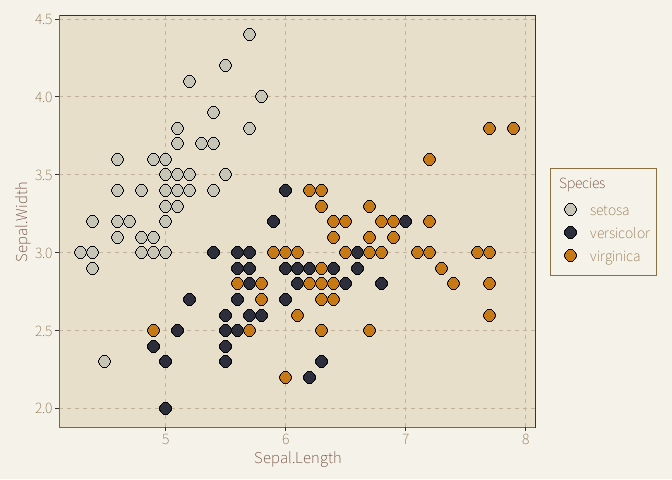

``` r
  
  my_pick <- create_color_pick(
   color_id = c(124, 324, 44),  
  order_rule = -1            
  )
 ggplot(mtcars, aes(mpg, wt, color = factor(cyl))) +
 geom_point(size = 4) +
  scale_colour_ctc_m(color_pick = my_pick) +  
 theme_ctc_bronze(oxidation_level = "fresh")
```


## Issues

Issues report：<https://github.com/zhiming-chen/chinacolor/issues>.

Palettes contribution and suggestions for improvement and optimization
are welcome!!

Gmail: <zhimingc383@gmail.com>
