<!-- README.md is generated from README.Rmd. Please edit that file -->

<!-- README.md is generated from README.Rmd. Please edit that file -->

| 语言 / Language | 版本                               |
|-----------------|------------------------------------|
| 🇨🇳 中文         | [README.zh-CN.md](README.zh-CN.md) |
| 🇺🇸 English      | [README.md](README.md)             |

# chinacolor :中国传统色

<!-- badges: start -->

<!-- badges: end -->

------------------------------------------------------------------------

## ✨ 最新更新

### v0.1.0 (2025-10-05)

**新功能**

- 新增
  `monochromatic_palette()`,`analogous_palette()`等10个自动生成调色板的函数；

- `ctc_palette()`函数输出调色板与内置调色板一样，具备`palette type`属性；

- `scale_fill/color _ctc_c/d()`系列标度函数，支持带对应属性的定制调色板，极大丰富其适用性；

**功能增强**

- 优化了部分连续型和发散性内置调色板,删除了部分调色板，新增了部分调色板，各类型数量未发生变化

- 优化了`theme_ctc_*()`系列函数内容，增加了theme选项

**问题修复**

- 修复了chinacolor 颜色基础数据汇总RGB值的错误

- 调整了`plot_palette()`函数颜色值及中文名称的字体大小

### 后续更新计划

- 从应用场景、行业属性等角度增加调色板及theme功能，如期刊发表，日常办公，客户导向等维度

- 机器学习与色彩理论、色彩心理学、配色原理等结合获得色彩心理模型，用于基于情绪及实物场景的配色方案生成

------------------------------------------------------------------------

以下是包含更新内容介绍材料

受中文书籍[《中国传统色：故宫里的色彩美学》](https://baike.baidu.com/item/%E4%B8%AD%E5%9B%BD%E4%BC%A0%E7%BB%9F%E8%89%B2%EF%BC%9A%E6%95%85%E5%AE%AB%E9%87%8C%E7%9A%84%E8%89%B2%E5%BD%A9%E7%BE%8E%E5%AD%A6/56817070)的启发制作本包，将该书中384种颜色关键信息整理成颜色数据信息，基于这些数据：

- 内置了顺序型、发散性和定性型调色板各20个；

- 内置了5款基于中国传统文化特色的适配ggplot的绘图主题；

- 形成了浏览、打印这些颜色和调色板的函数，快速获取颜色和调色板信息；

- 形成了利用这些颜色或内置调色板定制调色板的工具；

- **形成了根据需求定制调色板的系列函数，并将输出应用于scales系列函数；**

- 形成了适配ggplot绘图的scales系列函数。

<figure>

<figcaption aria-hidden="true">颜色图形</figcaption>
</figure>

<figure>

<figcaption
aria-hidden="true">带颜色分组编码的全部384种颜色</figcaption>
</figure>

<figure>
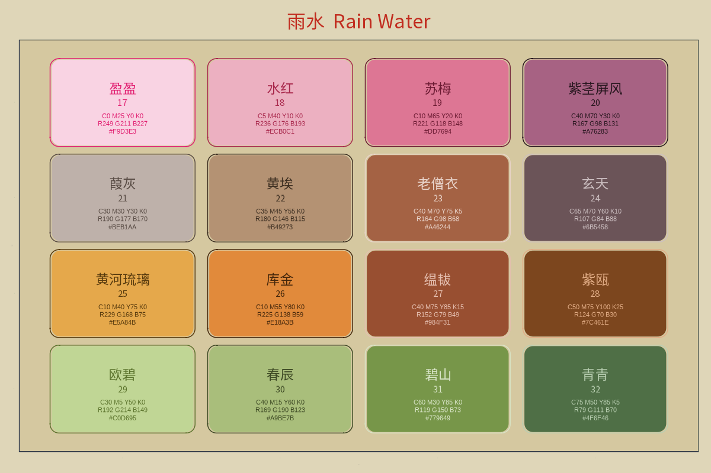
<figure>

<figure>
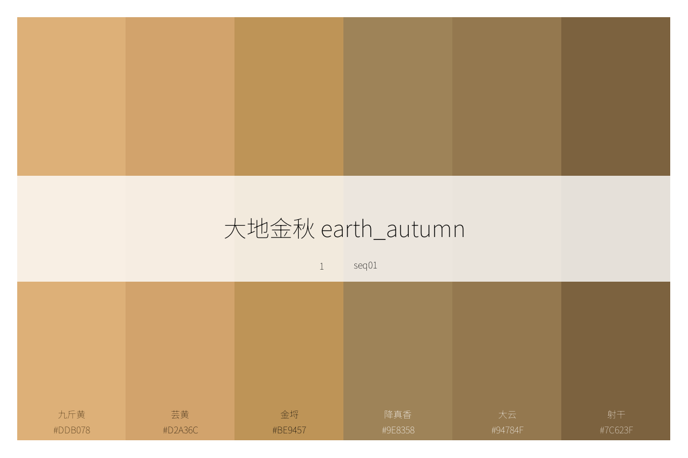
<figcaption aria-hidden="true">调色板示例</figcaption>
</figure>

<figure>
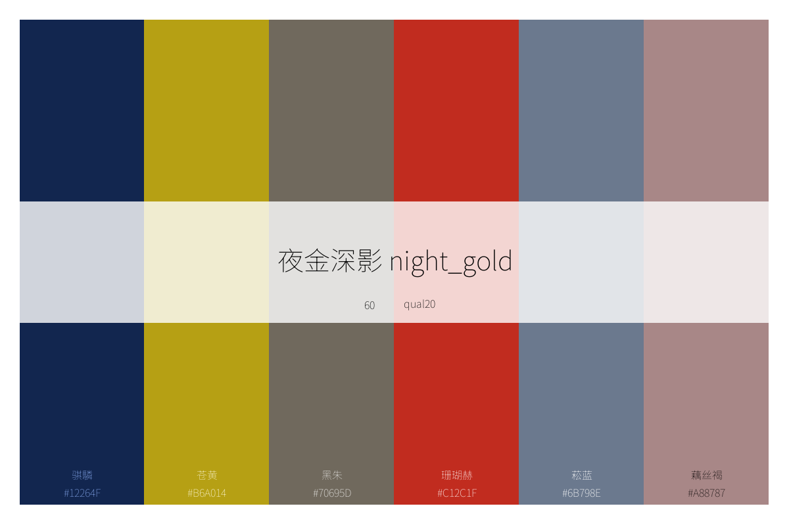
<figcaption aria-hidden="true">调色板示例</figcaption>
</figure>

## 安装

用如下方法安装本包开发版。

``` r
 # 用 devtools 安装
devtools::install_github("zhiming-chen/chinacolor")

# 或用 remotes 安装（语法相同）
remotes::install_github("zhiming-chen/chinacolor")
```

## 颜色:打印、预览与获取

### plot_color_grid 打印全部颜色

``` r
plot_color_grid(show_group = T)
```

可以在[colors_by_solar_term](https://github.com/zhiming-chen/chinacolor/tree/master/image/color/colors_by_solar_term)
中查看全部24个节气的颜色系列。

### list_colors 快速预览颜色

`list_colors`函数实现在Rstudio
中Viewer界面快速预览颜色，并即时获得颜色hex值，这个功能在我们设计调色板，或者绘图时调整颜色时提供帮助。

``` r
list_colors()
```


## 调色板：打印、预览、获取与定制

60组调色板被预置于本包中供调用。几个调色板示例：

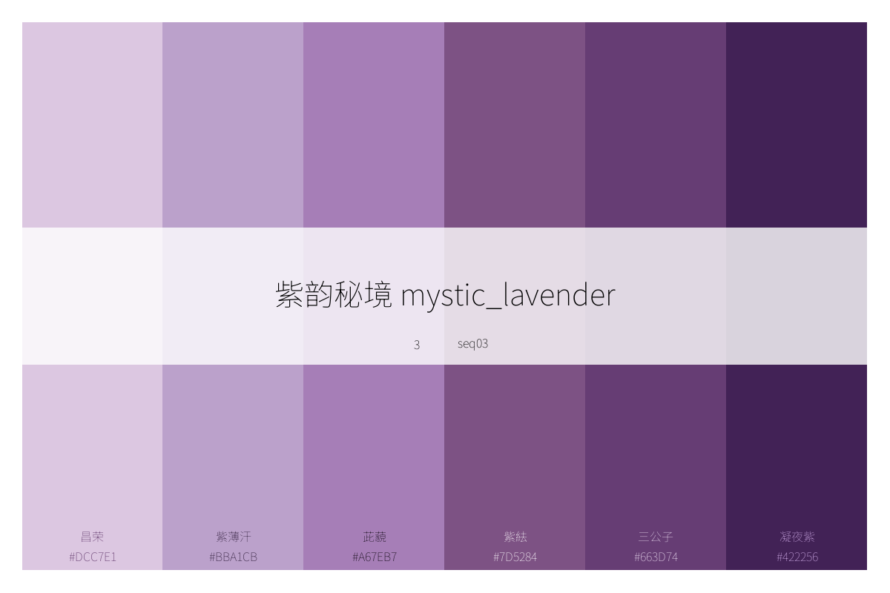

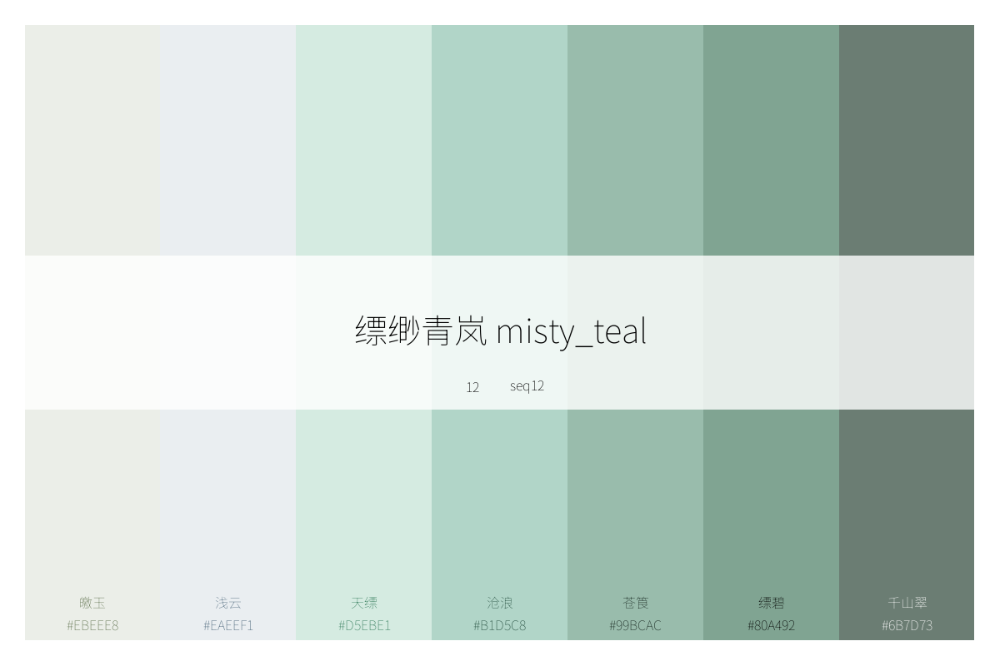

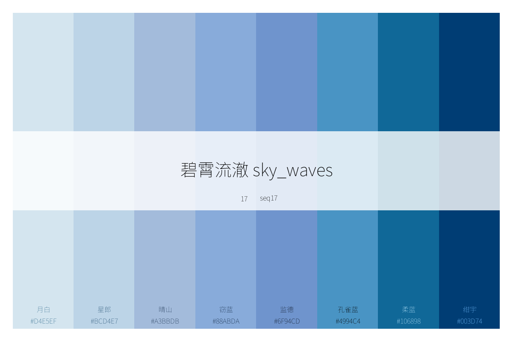

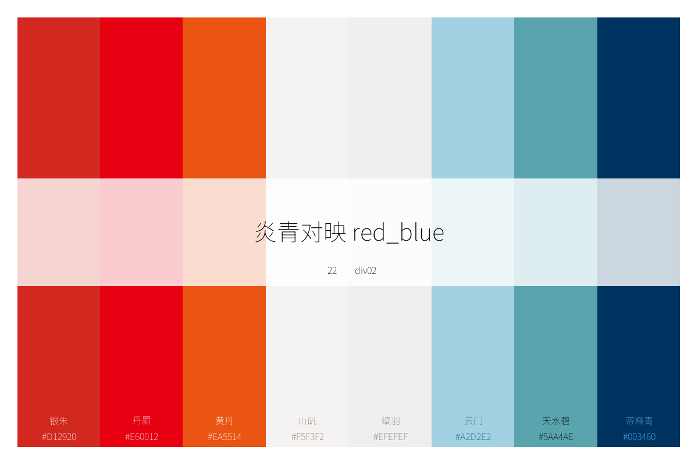

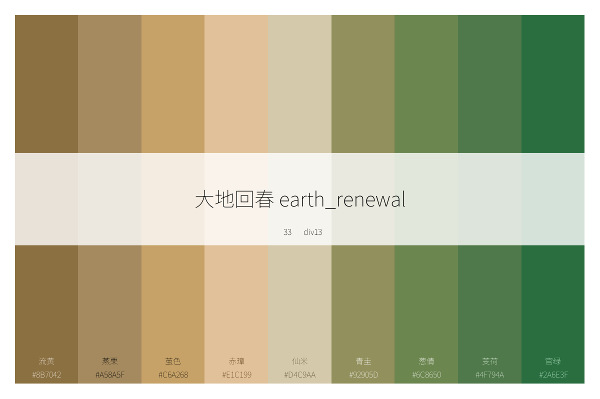

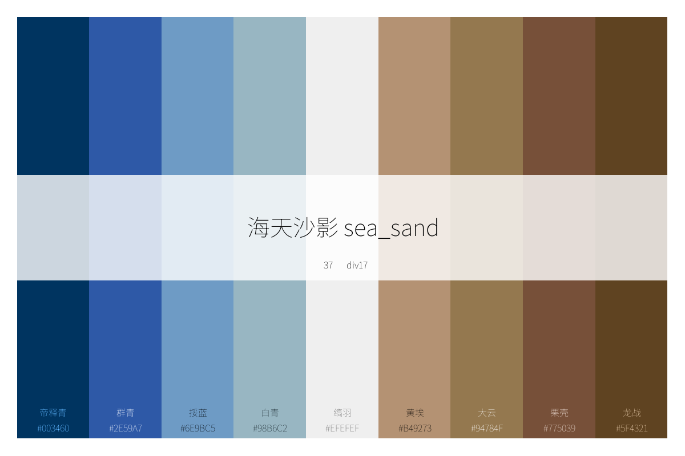

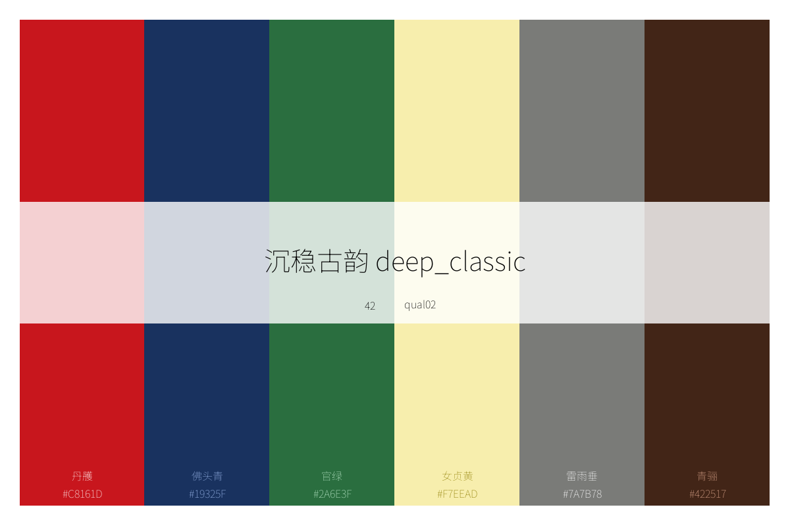

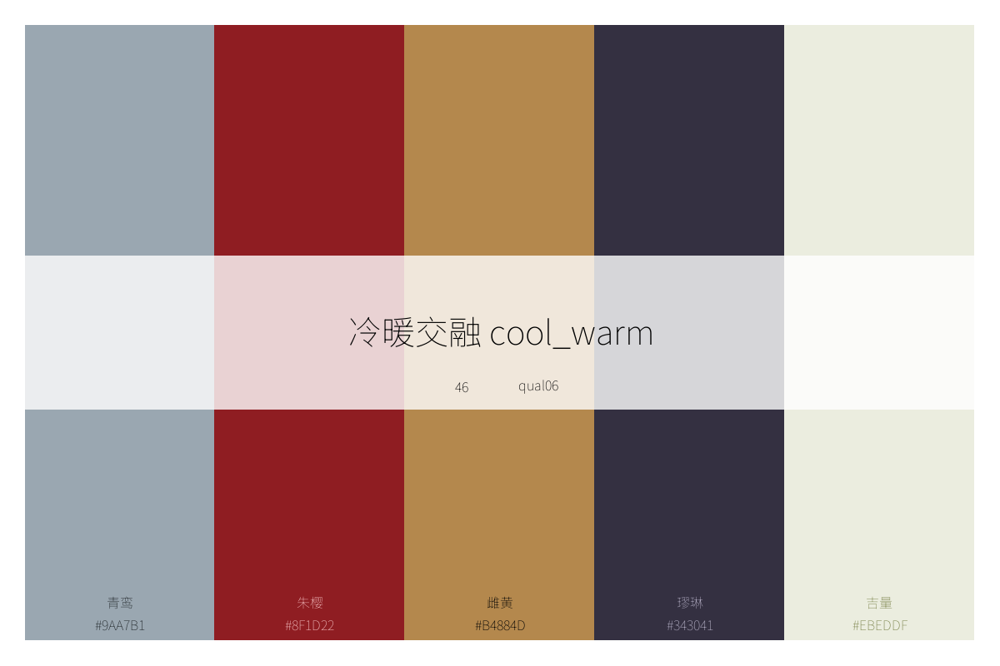

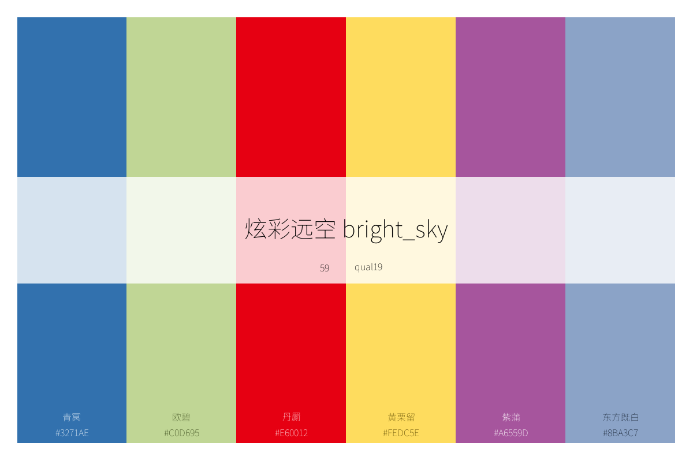

内置的调色板被定义为三种类型，顺序型，发散型和定性型。每种20个。

这些调色板被id化以及规则命名化：

- 顺序型调色板：

  - id：1-20

  - 命名：seq01-seq20。

- 发散型调色板：

  - id：21-40

  - 命名：div01-div20。

- 定性型调色板：

  - id：41-60

  - 命名：qual01-qual20。

当然，每个调色板也有其中文名称与英文名称，通过输入对应名称，可获取单个调色板信息。

### list_palettes 预览调色板

和预览颜色一样，调色板也可以在Viewer界面进行预览。

``` r

list_palettes()
```


我们还可以通过这个函数将这些内置调色板信息导出。

``` r
palettes_info <- list_palettes()

head(palettes_info,10)
#>       Index ElementName ChineseName     EnglishName       Type Colors
#> seq01     1       seq01    大地金秋    earth_autumn sequential      6
#> seq02     2       seq02    绯色年华  blooming_blush sequential      6
#> seq03     3       seq03    紫韵秘境 mystic_lavender sequential      6
#> seq04     4       seq04    珊瑚暖绯    coral_warmth sequential      7
#> seq05     5       seq05    幽兰绀紫   mystic_purple sequential      7
#> seq06     6       seq06    金秋丰韵  golden_harvest sequential      9
#> seq07     7       seq07    橘暖时光       warm_glow sequential      7
#> seq08     8       seq08    琥珀大地     amber_earth sequential      7
#> seq09     9       seq09    林间雾色     forest_mist sequential      6
#> seq10    10       seq10    琥珀流光      amber_glow sequential      7
```

### plot_palettes 打印多个调色板

`plot_palettes`
函数支持将多个调色板打印在一张图上，实现调色板的比较和选择。支持index和元素名称输入。

``` r
# 通过index值打印
plot_palettes(1:5)
```

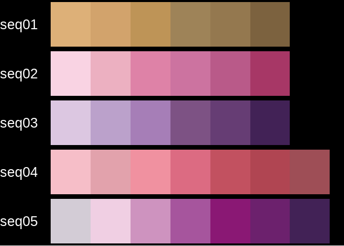

``` r

# 通过元素名称打印
plot_palettes(c("seq01","div02","qual14","qual18"))
```


### plot_palette 打印单个调色板

这个函数打印内置的调色板，也支持打印自定义的调色板。默认模式为内置调色板。

当打印内置调色板时，支持index，元素名称，及调色板的中英文名称作为输入。

- 打印内置调色板

``` r
# 根据index打印
plot_palette(x = 43,show_text = T)
```


``` r
# 根据元素名称打印，并对调色板进行重命名

plot_palette(x = "div13",name = "ONLY FOR PROJECT A!!!",show_text = T)
```


``` r
# 根据调色板英文名打印，显示颜色信息

plot_palette(x = "forest_mist",show_text = T)
```


``` r

# 根据调色板中文名打印，显示颜色信息
plot_palette(x = "碧海晴空",show_text = T)
```


对于内置调色板，打印图形中间条形块内显示了关于调色板的四个信息，以帮助大家进行快速记忆与选择。底部可现实颜色hex值及其中文名称。出于显示效果考虑，函数将该参数设置为非默认显示。

- 打印自定义调色板

对于自定义调色板，输入可以是颜色向量或向量对象名称。

对于来自384种内置的颜色，支持显示中文名。

``` r
# 设置调色板名称
plot_palette(x = c("#99BCAC","#5F4321","#BA5140","#DD7694","#779649"),type = "custom",name = "Just for Test",show_text = T)
```


``` r

# 未设置调色板名称。不显示颜色信息
plot_palette(x = c("#99BCAC","#5F4321","#BA5140","#DD7694","#779649"),type = "custom")
```


``` r
# 输入向量名,调色板的名称将是向量名

test_pal <- c("#C67915","#2C2F3B","#9A6655","#A72126","#446A37","#5B3222")
plot_palette(x = test_pal,type = "custom",show_text = T)
```


### ctc_palette 定制调色板

`ctc_palette`
函数用于定制调色板，并被`scale_fill(color)_ctc_c/d/m`系列函数调用。

`type`参数默认为`built_in`,即内置调色板。

#### 从内置调色板提取、定制

和`plot_palette`
一样，palette_name\`参数支持index，元素名称，调色板中英文名称四种类型。

`n`
颜色数量，对于定性型调色板，不推荐设置的颜色数量大于调色板中颜色数量。

一些示例：

``` r
# index + 显示调色板，定义颜色数量及方向：颜色数量小于调色板数量，方向与调色板方向相反
pal_1 <- ctc_palette(palette_name = 2,n = 5,direction = 1,show_colors = T)
#> Colors in the palette:
#> [1] "#F9D3E3" "#ECB0C1" "#DE82A7" "#CC73A0" "#B95A89"
#> Number of colors: 5
```


``` r
# 元素名称, 定义颜色数量：颜色数量大于调色板数量，默认方向及调色板显示选项
pal_2 <- ctc_palette(palette_name = "seq02",n = 12,show_colors = T) 
#> Colors in the palette:
#>  [1] "#F9D3E3" "#F3C3D3" "#EDB3C4" "#E69FB7" "#E08AAB" "#D97DA5"
#>  [7] "#D077A1" "#C86E9B" "#BF6391" "#B75685" "#AF4675" "#A73766"
#> Number of colors: 12
```


``` r
## 发散型调色板的示例
pal_3 <- ctc_palette(type = "built_in",palette_name = 22, n = 5, direction = 1,  show_colors = T)
#> Colors in the palette:
#> [1] "#E60012" "#EA5514" "#F5F3F2" "#EFEFEF" "#A2D2E2"
#> Number of colors: 5
```


``` r
pal_4 <- ctc_palette(type = "built_in",palette_name = 22, n = 12, direction = - 1)
```

``` r
# 对于定性型调色板，颜色数量设置大于调色板颜色数量，会循环使用调色板中的颜色，不推荐使用。如无合适内置调色板，可自行定制。
pal_5 <- ctc_palette(type = "built_in",palette_name = 44, n = 12,direction = 1,show_colors = T)
#> Colors in the palette:
#>  [1] "#C8161D" "#003460" "#B6A014" "#779649" "#A6559D" "#FEDC5E"
#>  [7] "#94784F" "#6E9BC5" "#C8161D" "#003460" "#B6A014" "#779649"
#> Number of colors: 12
```


``` r

pal_6 <- ctc_palette(type = "built_in",palette_name = 44, n = 5,direction = 1,show_colors = T)
#> Colors in the palette:
#> [1] "#C8161D" "#003460" "#B6A014" "#779649" "#A6559D"
#> Number of colors: 5
```


``` r
pal_7 <- ctc_palette(type = "built_in",palette_name = 44, direction = 1,show_colors = T)
#> Colors in the palette:
#> [1] "#C8161D" "#003460" "#B6A014" "#779649" "#A6559D" "#FEDC5E" "#94784F"
#> [8] "#6E9BC5"
#> Number of colors: 8
```


#### 从内置颜色中选择颜色定制调色板

此种模式下，`palette_name`调色板名称和`n`颜色数量两个以及`direction`颜色方向等参数失效。

使用color_pick参数来选择颜色组别及子组序号和或颜色ID，也可以在这里输入颜色顺序要求等。

更方便的是使用`create_color_pick` 这个辅助函数，便捷的生成`抓色`list。

- 定制一个9个颜色构成的发散型调色板

``` r
 
color_pick_1 <- create_color_pick(groups = c(11,13,12),
                                  subgroups = list(4:1,1,1:4),
                                  order_rule =1)
 
Palette_C <- ctc_palette(type = "custom",
            color_pick =color_pick_1,
            show_colors = T,
            palette_title = "金波碧浪")
#> Colors in the palette:
#> [1] "#C67915" "#DB9B34" "#FAC03D" "#FEDC5E" "#EBEEE8" "#9AA7B1" "#6B798E"
#> [8] "#45465E" "#2C2F3B"
#> Number of colors: 9
```


``` r
Palette_C
#> [1] "#C67915" "#DB9B34" "#FAC03D" "#FEDC5E" "#EBEEE8" "#9AA7B1" "#6B798E"
#> [8] "#45465E" "#2C2F3B"
#> attr(,"type")
#> [1] "qualitative"
#> attr(,"n")
#> [1] 9
#> attr(,"ctc_colors")
#> [1] TRUE
```

- 定制一个6个颜色构成的定性型调色板

``` r
color_pick_2 <- create_color_pick(groups = 10:15,
                                  subgroups = 3,
                                  order_rule =1)
color_pick_3 <- create_color_pick(groups = 10:15,
                                  subgroups = 4,
                                  order_rule =-1)

Palette_A <-  ctc_palette(type = "custom",
            color_pick =color_pick_2,
            show_colors = T,
            palette_title = "Palette A")
#> Colors in the palette:
#> [1] "#DC6B82" "#DB9B34" "#45465E" "#E0E0D0" "#B26D5D" "#C8161D"
#> Number of colors: 6
```


``` r
Palette_B <- ctc_palette(type = "custom",
            color_pick =color_pick_3,
            show_colors = T,
            palette_title = "Palette B")
#> Colors in the palette:
#> [1] "#A72126" "#9A6655" "#C7C6B6" "#2C2F3B" "#C67915" "#C35C5D"
#> Number of colors: 6
```


``` r
Palette_A 
#> [1] "#DC6B82" "#DB9B34" "#45465E" "#E0E0D0" "#B26D5D" "#C8161D"
#> attr(,"type")
#> [1] "qualitative"
#> attr(,"n")
#> [1] 6
#> attr(,"ctc_colors")
#> [1] TRUE
Palette_B
#> [1] "#A72126" "#9A6655" "#C7C6B6" "#2C2F3B" "#C67915" "#C35C5D"
#> attr(,"type")
#> [1] "qualitative"
#> attr(,"n")
#> [1] 6
#> attr(,"ctc_colors")
#> [1] TRUE
```

#### 带类型属性的定制调色板 **(新增功能)**

`ctc_palette()`函数生成的每个调色板都有一个调色板类型的属性；

- 当函数参数为`built_in`时，其输出的调色板类型等于内置调色板的类型；如前文生成的调色板，其类型如下：

``` r
attr(pal_1,"type")
#> [1] "sequential"
attr(pal_3,"type")
#> [1] "diverging"
attr(pal_5,"type")
#> [1] "qualitative"
```

- 当函数参数为`custom`时，可自定义其输出的调色板类型，默认设置为`qualitative`。我们可以根据自己对自定义调色板的类型认知来进行定义。

- 调色板类型只支持`sequential`
  ,`diverging`,`qualitative`这三种类型，定义为其他类型都将被默认为`qualitative`类型。

前文中Palette_A/B/C等自定义调色板未定义调色板类型，默认为`qualitative`

``` r
attr(Palette_A,"type")
#> [1] "qualitative"
attr(Palette_B,"type")
#> [1] "qualitative"
attr(Palette_C,"type")
#> [1] "qualitative"
```

但对于Palette_C，我们认为其为发散型调色板，palette type 为`diverging`,
根据**更新的函数功能**，我们可以自定义其类型:

``` r
color_pick_1 <- create_color_pick(groups = c(11,13,12),
                                  subgroups = list(4:1,1,1:4),
                                  order_rule =1)
 
Palette_D <- ctc_palette(type = "custom",
            color_pick =color_pick_1,
            show_colors = T,
            palette_title = "金波碧浪",palette_type = "diverging")
#> Colors in the palette:
#> [1] "#C67915" "#DB9B34" "#FAC03D" "#FEDC5E" "#EBEEE8" "#9AA7B1" "#6B798E"
#> [8] "#45465E" "#2C2F3B"
#> Number of colors: 9
```


``` r
attr(Palette_D,"type")
#> [1] "diverging"
```

因为其类型不同，在后面将介绍的调色板与`scale*`系列函数结合使用时也不一样。

基于这些属性确认，可以灵活的在**本次更新**的`sacle_fill/color_ctc_c/d()`等函数中直接应用。

## 自动生成调色板函数(**新增功能**)

本次更新的一个系列功能。

R语言世界里，有很多用于绘图调色板的包，大量的调色板供大家调用，如本包内置的60个调色板，看起来肯定也仅仅是冰山一角。

很多时候，我们想自定义调色板，本包中`ctc_palette()`函数也部分实现了这个功能，但略显笨重。

受`adobe CC`启发，生成了基于一般配色原理和思路的自动生成调色板函数，总共10个函数，可生成单色系连续型调色板，多色系渐变/类比调色板,发散型调色板、三元群、方形、对比、补色、离散均匀分布等各类常见的离散型配色方案。

这里简单罗列几个函数生成调色板，并与[adobe
CC](https://color.adobe.com/zh/create/color-wheel) 生成结果对比展示。

### 生成调色板

- `monochromatic_palette()` 函数生成同色系连续渐变色调色板

可以指定基色(也可以默认为空，将从384种内置颜色中随机指定一个颜色)，颜色数量，亮度范围，是否使用本包内置的384中中国传统色.

*因为内置的颜色较少，对于具有连续渐变属性的调色板，选用内置颜色时，会出现一些非预期的情形*

``` r
pal_mono <- monochromatic_palette(base_color = "#DB9C53",n = 6,ctc_colors = F,show_pal = T)
```


``` r
pal_mono_ctc <- monochromatic_palette(base_color = "#DB9C53",n = 6,ctc_colors = T,show_pal = T)
```

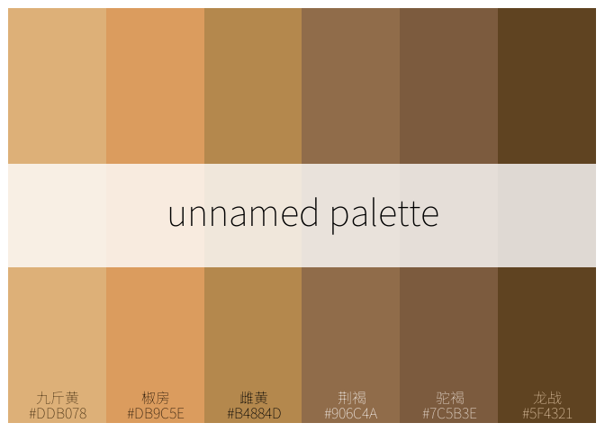

- `analogous_palette()` 函数生成类比色

该函数依据类比色定义及原理，生成基色hue值两侧30度左右范围内的调色板(范围可自行定义)，颜色亮度基本总体保持不变。

当颜色数量较多而hue值递进幅度较小时，该函数实现了不同hue值在一定范围内连续渐变的色环效应。

``` r
pal_analog <- analogous_palette(base_color = "#DB9C53",n = 6,ctc_colors = F,show_pal = T,spread = 15)
```


``` r
pal_analog_ctc <- analogous_palette(base_color = "#DB9C53",n = 6,ctc_colors = T,show_pal = T,spread = 15)
```

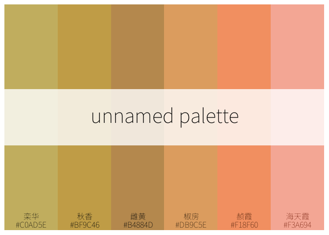

实现 不同hue值在一定范围内连续渐变的`色环效应`

``` r
pal_analog_hue <- analogous_palette(base_color = "#FF0C00",n = 9,ctc_colors = F,show_pal = T,spread = 5)
#> Warning in analogous_palette(base_color = "#FF0C00", n = 9, ctc_colors =
#> F, : It is highly recommended that the number of colors is no less than
#> 3 and no more than 7.
```


- `triadic_palette()` 函数生成三元群调色板

以基色hue为起始计算点，以120度为幅度递增，获得3个hue色环上的颜色，再根据输入颜色数量来确定颜色，形成三元群调色板。

``` r
pal_tri <- triadic_palette(base_color = "#DB9C53",n = 6,ctc_colors = F)
```


``` r

pal_tri_ctc <- triadic_palette(base_color = "#DB9C53",n = 6,ctc_colors = T)
```


- `intermediate_palette` 函数生成`方形`调色板

以基色hue为基准，90度递增获得总共四个颜色，以此四个颜色及颜色数量来获得调色板。当颜色数量为4时，与`harmonic_palette()`函数获得的结果一致。

这个函数获得的调色板对比往往比较很强烈。

``` r
pal_square <- intermediate_palette(base_color = "#DB9C53",n = 6,ctc_colors = F)
```


``` r
pal_square_ctc <- intermediate_palette(base_color = "#DB9C53",n = 6,ctc_colors = T)
```

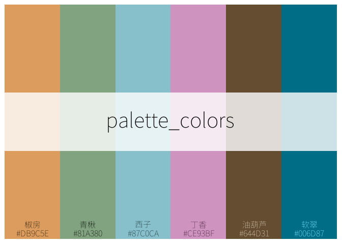

- `complementary_palette` 函数生成互补色调色板

根据基色确定互补色，再根据颜色数量得到互补色调色板。

``` r
pal_comp <- complementary_palette(base_color = "#DB9C53",n = 6,ctc_colors = F)
```


``` r
pal_comp_ctc <- complementary_palette(base_color = "#DB9C53",n = 6,ctc_colors = T)
```

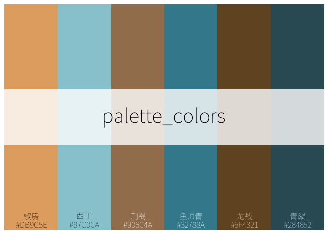

- `split_complementary_palette`函数生成分裂补色调色板

与三角群调色板相近，获取基色hue值两侧各150度角处的颜色，后根据颜色数量生成调色板。

``` r
pal_split <- split_complementary_palette(base_color = "#DB9C53",n = 6,ctc_colors = F)
```


``` r
pal_split_ctc <- split_complementary_palette(base_color = "#DB9C53",n = 6,ctc_colors = T)
```

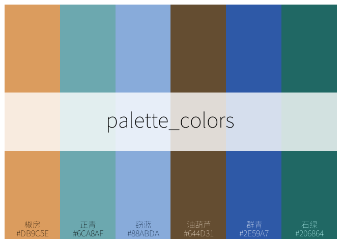

- `concyclic_palette`函数生成混合效果调色板

实现基色及其hue值偏移45度后的颜色，基于这两个颜色与其同侧对称色和颜色数量确定调色板。

``` r
pal_conc <-  concyclic_palette(base_color = "#DB9C53",n = 6,ctc_colors = F)
```


``` r
pal_conc_ctc <-  concyclic_palette(base_color = "#DB9C53",n = 6,ctc_colors = T)
```


- `antipodal_palette`函数生成混合效果调色板

与`concyclic_palette`函数类似，该函数实现颜色双侧對称分布。分布在色轮上的四个点中，有三个点与`concyclic_palette`函数是相同的。视觉效果上，该函数生成的调色板对比度更强烈，视觉冲击会更强。

``` r
pal_anti <- antipodal_palette(base_color = "#DB9C53",n = 6,ctc_colors = F)
```


``` r
pal_anti_ctc <- antipodal_palette(base_color = "#DB9C53",n = 6,ctc_colors = T)
```


- `harmonic_palette` 函数生成均匀分布离散型调色板

在hue360度色相环上均匀取值，以基色hue值为起始计算点；典型的离散色场景。

相对于其他离散型调色板生成函数，这个函数能支持颜色数量比较多的场景，但也不建议超过12个。

``` r
pal_harmonic <- harmonic_palette(base_color = "#DB9C53",n = 6,ctc_colors = F)
```

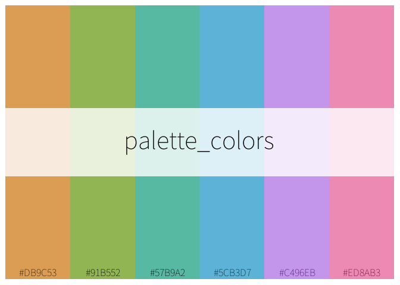

``` r
pal_harmonic_ctc <- harmonic_palette(base_color = "#DB9C53",n = 8,ctc_colors = T)
```

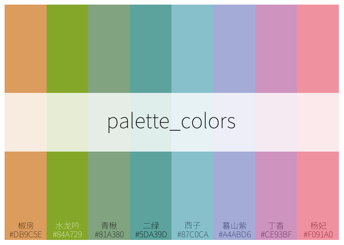

- `diverging_palette`函数生成发散型调色板

以基色hue为基准，根据设计的发散另一端颜色角度(默认120度)及颜色数量，生成发散性调色板。

同时可设置亮度范围来定义调色板总体亮度。

当颜色数量较多时，为总体发散渐变效果考虑，可不选择使用内置的384颜色。

``` r
# 较宽的亮度范围
pal_div_ctc <- diverging_palette(base_color = "#DB9C53",n = 9,ctc_colors = T,lightness_range = c(15,95))
```

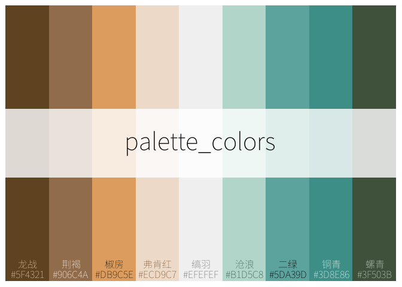

``` r

# 较窄的亮度范围，偏亮设计,调整角度为90度，减少视觉上的对比冲击
pal_div <- diverging_palette(base_color = "#DB9C53",n = 9,ctc_colors = F,lightness_range = c(40,95),angle = 90)
```

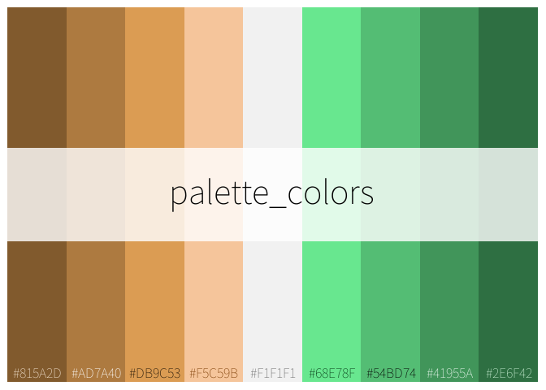

### 自动生成调色板汇总预览

汇总预览”#DB9C53”颜色为基色生成的各类调色板,全部选择使用内置384种颜色.

``` r
swatchplot("单色系" = pal_mono_ctc,
           "类比色" = pal_analog,
           "发散色" = pal_div_ctc,
           "三元群" = pal_tri,
           "四方形" = pal_square_ctc,
           "互补色" = pal_comp_ctc,
           "分裂补色" = pal_split_ctc,
           "混合_1" = pal_conc_ctc,
           "混合_2" = pal_anti_ctc,
           "均匀离散" = pal_harmonic_ctc,
           line = 4
           )
```

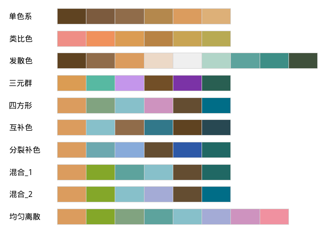

### 几组与adobe CC的简单效果对比

上述函数目前还是很初级的阶段，参与调色板设计输出的参数非常之少，仅仅基于一些基础的配色原理在输出。但因为遵循了一些基础配色原理，所以输出的效果肯定是可以出街亮相用于数据可视化等实际场景的。

这里以 “\#DB9C53”为基色，调色板颜色数量6,为基础，与adobe CC
的效果做个效果对比。

``` r
# 用于处理颜色顺序的辅助函数

ordered_color_set <- function(color_set,direction = 1){ #1 大到小，2 小到大

    color_set_order <-  color_set %>%
        .get_hcl_values() %>%
        .[,1] %>%
        order()

    color_set <- if (direction == 1){
        color_set[color_set_order]} else{
            color_set[rev(color_set_order)]
        }

    return(color_set)
}


ordered_color_set_hue <- function(color_set,direction = 1){ #1 大到小，2 小到大

    color_set_order <-  color_set %>%
        .get_hcl_values() %>%
        .[,3] %>%
        order()

    color_set <- if (direction == 1){
        color_set[color_set_order]} else{
            color_set[rev(color_set_order)]
        }

    return(color_set)
}
```

- 连续渐变色

- adoble CC 得到的结果

``` r
color_cc_mono <- c("#b18b61","#867460","#db9c53","#5c5751","#332d26","#33291e") %>%
    ordered_color_set(direction = 1)

color_cc_shade <- c("#D39650","#B17E43","#db9c53","#8F6536","#6D4D29","#4B351C") %>%
    ordered_color_set(direction = 1)
```

``` r
swatchplot("mono_F" = pal_mono,
           "mono_T" = pal_mono_ctc,
           "CC_shade" = color_cc_shade,
           "CC_mono" = color_cc_mono)
```

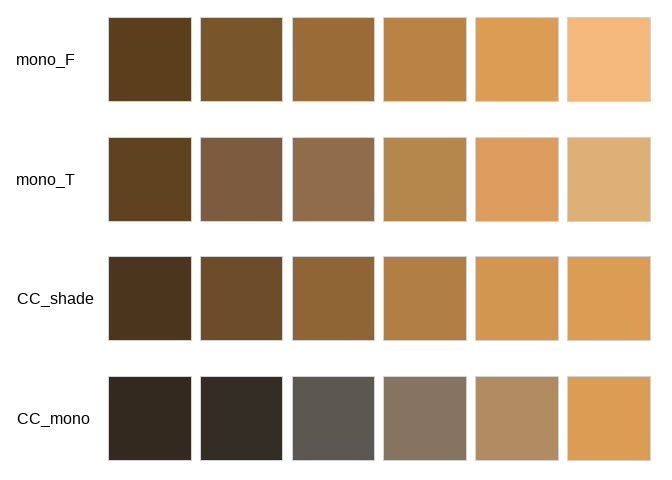

- 三元群调色板

``` r
# adobe CC 的颜色结果
 color_cc_tri <- c("#8453db","#53db6d","#db9c53","#867460","#55515c","#515c53")


# 为了排序效果一致，对CC 的颜色组合排序进行处理

test_tri <- find_closest_colors(target_colors = pal_tri,ref_colors = color_cc_tri)
color_cc_tri <- test_tri$closest_ref

swatchplot("tri_F" = pal_tri,
           "tri_T" = pal_tri_ctc,
           "CC_tri" = color_cc_tri)
```

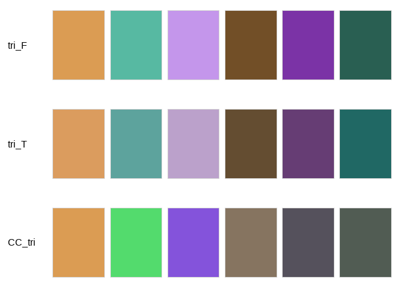

- `正方形`调色板

``` r
# adobe CC 的颜色结果
color_cc_square <- c("#CF53db","#53B3db","#db9c53","#93db53","#867460","#5b515c")

# 为了排序效果一致，对CC的颜色组合排序进行处理
test_square <- find_closest_colors(target_colors = pal_square, ref_colors = color_cc_square)
color_cc_square <- test_square$closest_ref

swatchplot("square_F" = pal_square,
           "square_T" = pal_square_ctc,
           "CC_square" = color_cc_square)
```

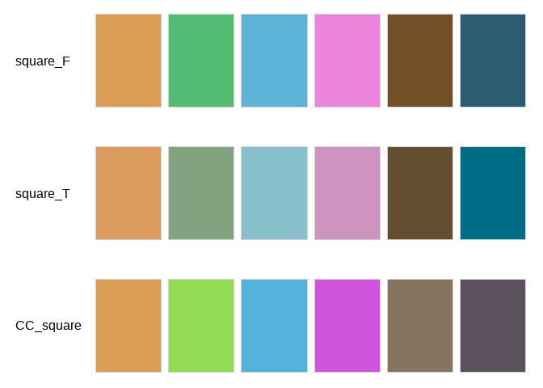

## 在ggplot里使用调色板

`ctc_palette`函数输出一组颜色hex值，这些输出可直接作为颜色的value用于ggplot绘图。

`monochromatic_palette`等生成调色板的函数的输出，同样可用于ggplot绘图

- 离散色 + 填充 场景

``` r

# ctc_palette 函数输出结果：直接调取内置调色板
ggplot(data = iris,aes(x = Species,y = Petal.Length,fill = Species))+
    geom_violin()+
    scale_fill_manual(values = ctc_palette(palette_name = 48,n = 3))
```

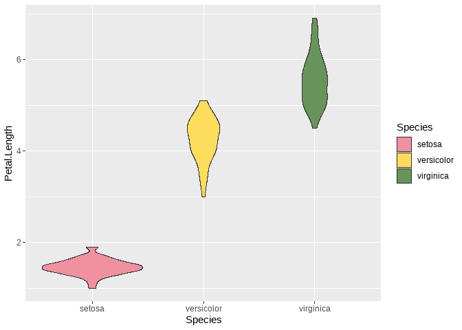

``` r

# ctc_palette 函数输出结果，使用该函数定制的调色板
ggplot(data = iris,aes(x = Species,y = Petal.Length,fill = Species))+
    geom_violin()+
    scale_fill_manual(values = Palette_A)
```


``` r

# 使用自动生成的调色板，本例使用triadic_palette()函数生成的调色板
ggplot(data = iris,aes(x = Species,y = Petal.Length,fill = Species))+
    geom_violin()+
    scale_fill_manual(values = pal_tri_ctc)
```

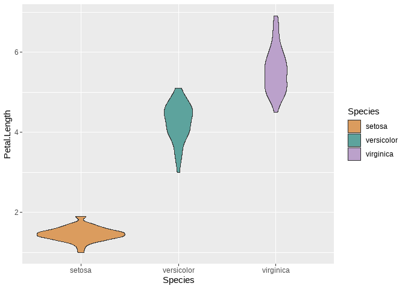

- 离散色 + 颜色 场景

选择内置定性型调色板

``` r
ggplot(data = iris,aes(x = Sepal.Length  ,y = Sepal.Width  ,color = Species))+
    geom_point(size = 4)+
    scale_color_manual(values = ctc_palette(palette_name = 44,n = 3))
```

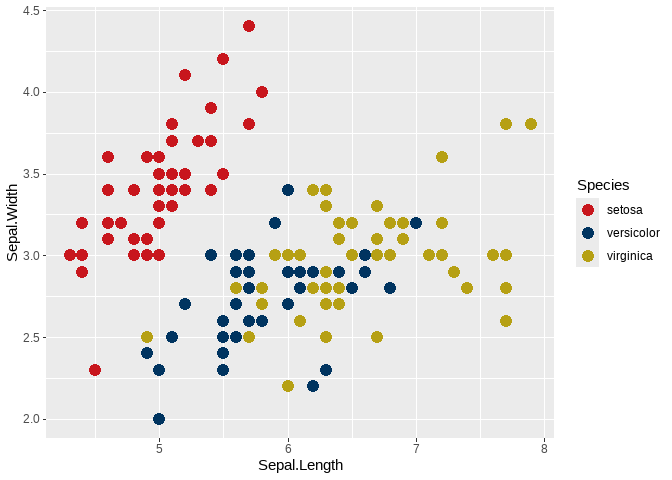

``` r

ggplot(data = iris,aes(x = Sepal.Length  ,y = Sepal.Width  ,color = Species))+
    geom_point(size = 4)+
    scale_color_manual(values = pal_harmonic_ctc)
```

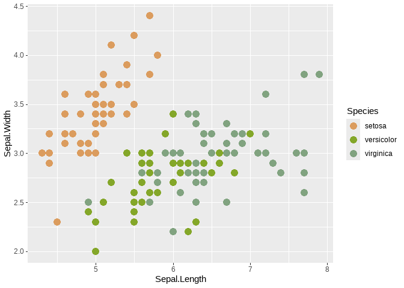

- 连续色 + 颜色 场景

选择顺序型内置调色板

``` r
ggplot(data = iris,aes(x = Species,y = Sepal.Width,color = Sepal.Width))+
    geom_point(size = 4)+
    scale_color_gradientn(colours = ctc_palette(palette_name = 9))
```

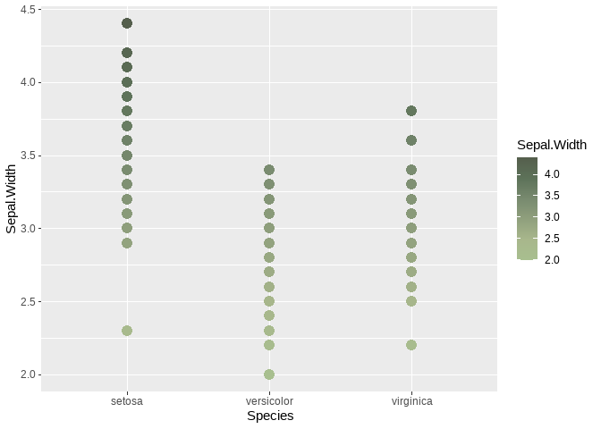

``` r


# 使用函数生成的连续型调色板

pal_seq <- monochromatic_palette(base_color = "#D23918",n = 9,ctc_colors = T,show_pal = F,lightness_range = c(10,95))

ggplot(data = iris,aes(x = Species,y = Sepal.Width,color = Sepal.Width))+
    geom_point(size = 4)+
    scale_color_gradientn(colours = rev(pal_seq))
```


- 连续色 + 填充 场景

本例使用前文中定制的发散型调色板向量。

``` r
 
df <- expand.grid(x = 1:20, y = 1:20)
df$z <- (df$x - 10) * (df$y - 10)   

ggplot(df, aes(x, y, fill = z)) +
  geom_tile(color = "white", linewidth = 0.3) +   
  scale_fill_gradientn(
    colours = rev(Palette_C), # 进行反转，冷色代表负值，暖色代表正值。
    name = "Values",
  ) +
  labs(title = "Palette Test") +
  theme_minimal()
```

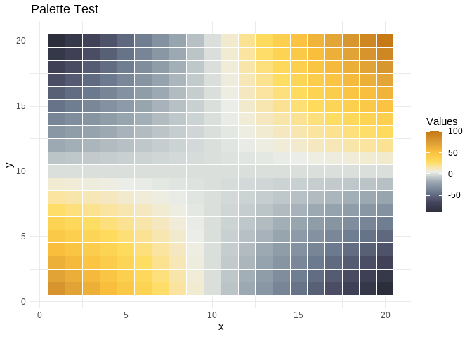

## 适配ggplot绘图：scales 标度系列函数及theme主题模版

### 更新说明

1.  `scale` 系列函数调色板输入进行了重要调整： 对于`*_d`
    和`*_c`系列函数，上一版本支持内置调色板，更新后支持任何具有规定要求属性的调色板。

- `*_d` 系列 支持`qualitative`类型调色板
- `*_c` 系列 支持`seqential` 和`diverging`类型调色板

`ctc_palette`函数本次已进行更新，输出调色板有类型属性，该函数`custom`情形下的输出也可以用于`*_d`
和`*_c`系列函，这对上一版本是一个更新，后续scale系列函数中的`*_m`系列会逐渐取消。

`monochromatic_palette`等10个自动生成调色板的函数的输出，也可以直接用于`scale`系列函数；

甚至，任何一个自定义的颜色向量，可以人工赋值调色板类型属性，也是可以用于这个系列函数。

2.  `theme` 函数进行了更新，增加了一些方案，对`ink`
    系列函数进行比较大的变动，上一版本的显示效果很差，本次更新，显示效果得到很大改善。

### 六组 scales 标度系列函数：

- scale_fill_ctc_d :离散色填充场景

- scale_color_ctc_d：离散色颜色场景

- scale_fill_ctc_c：连续色填充场景

- scale_color_ctc_c：连续色颜色场景

- scale_fill_ctc_m：定制色填充场景，只支持离散色场景

- scale_color_ctc_m：离散色颜色场景，只支持离散色场景

前四个函数支持将内置调色板作为输入，与`ctc_palette()`一样，支持四种输入调色板信息来获取内置调色板；

后两个支持将定制的调色板作为输入；可等价于ggplot包中`scale_fill(color)_m()`函数;同时支持color_pick
list，可由create_color_pick()函数生成，也可手动生成，属于384种颜色的专属定制色输入通道。

### 五组ggplot绘图的theme主题，基于中国传统文化元素制作，可供选用。

- theme_ctc_paper： 宣纸主题

- theme_ctc_dunhuang：敦煌主题

- theme_ctc_bronze：青铜器主题

- theme_ctc_mineral：大地主题

- theme_ctc_ink：水墨山水画主题

### 调色板生成及调用 + scale系列函数 + theme 系列函数组合案例

#### theme_ctc_ink() + ctc_palette()+ scale\_\* 组合

自定义的diverging 发散性调色板，直接用于`scale`系列函数

``` r
 # ctc_palette 函数生成的发散型调色板 + scale_*_c 系列函数

df <- expand.grid(x = 1:20, y = 1:20)
df$z <- (df$x - 10) * (df$y - 10) 

ggplot(df, aes(x, y, fill = z)) +
  geom_tile(color = "white", linewidth = 0.3) +   
  scale_fill_ctc_c(palette_name = Palette_D ,direction = -1) + # 使用前文ctc_palette 函数生成的发散型调色板
  labs(title = "Palette Test",
       subtitle = "带属性调色板与scale系列函数结合使用_案例1") +
  theme_ctc_ink(background_type = "dark")
```

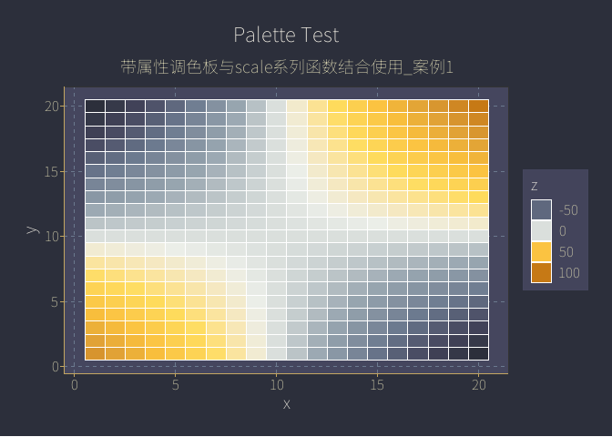

#### theme_ctc_dunhuang() + monochromatic_palette()等函数+ scale\_\* 组合

``` r
data("mtcars")
dfm <- mtcars

# Add the name colums
dfm$name <- rownames(dfm)

p1 <- ggpubr::ggdotchart(dfm, x = "name", y = "mpg",
           color = "mpg",                            
           sorting = "ascending",  
           add = "segments" 
           )

pal_mono_2 <- monochromatic_palette(base_color = "#007175",n = 7,lightness_range = c(10,95),show_pal = F)
p2 <- p1 +
  scale_color_ctc_c(palette_name = pal_mono_2,direction = -1)+ 
    theme_ctc_dunhuang(bg_type = "classic",
                       text_angle_control = F,
                       grid_major = F,
                       grid_minor = F) +
    labs(title = "Palette Test",
       subtitle = "带属性调色板与scale系列函数结合使用_案例2") 
p1
```

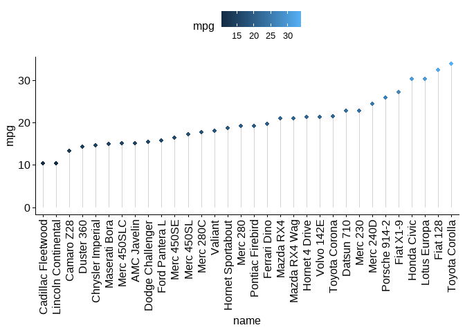

``` r
p2
```

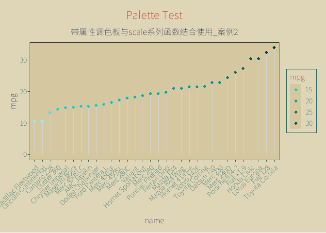

``` r

#使用离散色

# Convert the cyl variable to a factor
dfm$cyl <- as.factor(dfm$cyl)

p3 <- ggpubr::ggdotchart(dfm, x = "name", y = "mpg",
           color = "cyl",  
            sorting = "ascending",    
           add = "segments"   
           )
pal_anti_2 <- antipodal_palette(base_color = "#D23918",n = 8,show_pal = F)
p4 <- p3 +
    scale_color_ctc_d(palette_name = pal_anti_2)+
    theme_ctc_dunhuang(bg_type = "classic",
                       text_angle_control = F,
                       grid_major = F,
                       grid_minor = F)

p3 
```

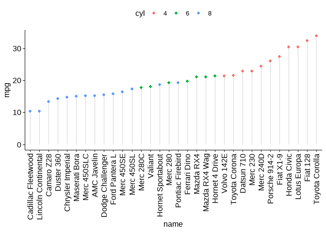

``` r
p4
```

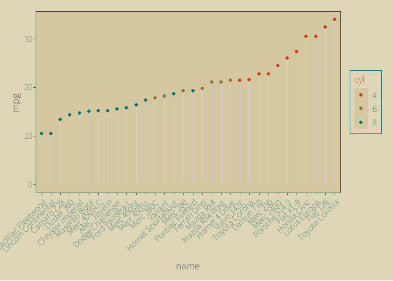

``` r
 # scale_fill_ctc_m 函数

 ggplot(iris, aes(Sepal.Length, Sepal.Width, fill = Species)) +
 geom_point(shape = 21, size = 3) +
 scale_fill_ctc_m(color_pick = color_pick_2) + ## 本例使用前文中已完成的pick_color list。
theme_ctc_dunhuang(bg_type = "modern")
```


#### theme_ctc_mineral() + intermediate_palette()等函数+ scale\_\* 组合

``` r
 iris$sepal_group <- cut(
     iris$Sepal.Length,
    breaks = 4,
   labels = paste0("组", 1:4)
 )
# 使用调色板index值 + mineral绘图主题
 ggplot(iris, aes(x = Sepal.Width,
                       y = Petal.Width,
                       color = sepal_group)) +
    geom_point(size = 2.5) +   
   geom_smooth(method = "lm", formula = y ~x, se = FALSE) +   
     scale_color_ctc_d(palette_name = 60)+   
    theme_ctc_mineral(background_type = "classic") 
```

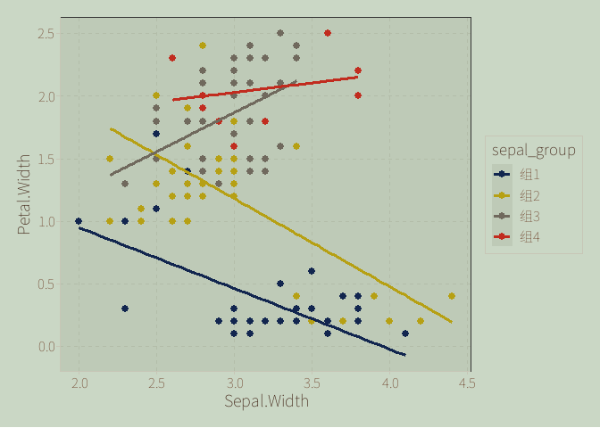

``` r

# 使用函数生成调色板 + mineral绘图主题

pal_square_2 <- intermediate_palette(base_color = "#06436F",n = 7,show_pal = F)
 ggplot(mpg, aes(x = class, fill = class)) +
 geom_bar() +
 scale_fill_ctc_d(palette_name = pal_square_2)+
 theme_ctc_mineral(background_type = "light")
```


#### theme_ctc_paper() + analogous_palette()等函数+ scale\_\* 组合

``` r

# 使用调色板英文名称
 ggplot(mtcars, aes(x = wt, y = mpg, color = hp)) +
 geom_point(size = 4) +
 scale_colour_ctc_c(palette_name = "vibrant_spring", direction = -1)+
    theme_ctc_paper(paper_type = "aged")
```


``` r
# 使用函数生成的调色板
ggpubr::ggbarplot(dfm, x = "name", y = "mpg",
          fill = "mpg",    
          color = "white",   
 
          sort.val = "desc",         
          sort.by.groups = FALSE,   
          ) +
  scale_fill_ctc_c(palette_name = pal_analog_hue, direction = -1)+
  theme_ctc_paper()+
  theme(axis.text.x = element_text(angle = 90))
```

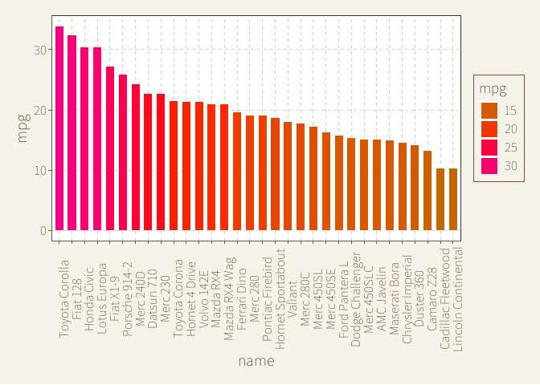

#### theme_ctc_bronze() + diverging_palette()等函数+ scale\_\* 组合

``` r
 #使用调色板中文名称 + 古铜主题
ggplot(faithfuld, aes(x = eruptions, y = waiting, fill = density)) +
 geom_raster() +
 scale_fill_ctc_c(palette_name = "海天沙影", direction = 1)+
    theme_ctc_bronze()
```


``` r
 # 使用diverging_palette函数生成的调色板 + 古铜主题

ggplot(faithfuld, aes(x = eruptions, y = waiting, fill = density)) +
 geom_raster() +
 scale_fill_ctc_c(palette_name = pal_div_ctc, direction = -1)+
    theme_ctc_bronze(oxidation_level = "medium")
```

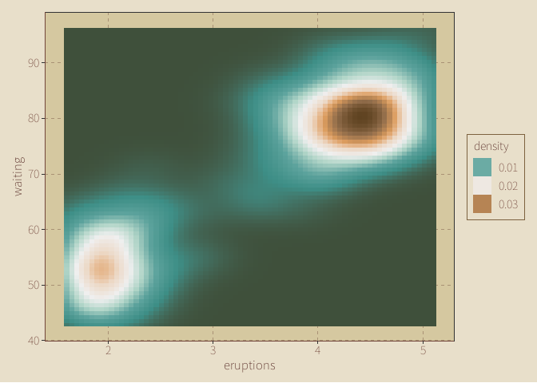

``` r


Pal_b <- Palette_B[3:5]
 
ggplot(iris, aes(Sepal.Length, Sepal.Width, fill = Species)) +
 geom_point(shape = 21, size = 4,stroke = 0.8) +
 scale_fill_ctc_m(palette = Pal_b) + ## 支持输入颜色向量，此时等同于scale_fill_manual 函数
 theme_ctc_bronze(oxidation_level = "light")
```


``` r
  
  my_pick <- create_color_pick(
   color_id = c(124, 324, 44),  
  order_rule = -1            
  )
 ggplot(mtcars, aes(mpg, wt, color = factor(cyl))) +
 geom_point(size = 4) +
  scale_colour_ctc_m(color_pick = my_pick) +  
 theme_ctc_bronze(oxidation_level = "fresh")
```

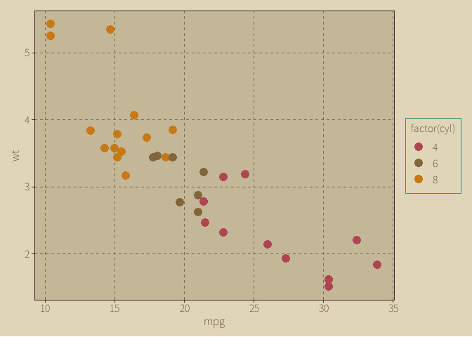

## Issues

You can submit issues and report bugs via
<https://github.com/zhiming-chen/chinacolor/issues>.

We also welcome contributions of color schemes and suggestions for
improvements and optimizations.

Public Account, Zhihu: 空行马天君; QQ Email: <25172952@qq.com>
